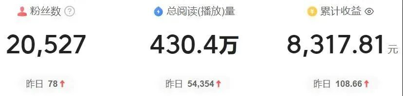

# Web 定义

## 一、Web 1.0

这是第一代互联网，主要是静态内容，用户只是浏览，只读不写，最多发表个评论。最典型是当年三大门户网站，新浪，网易，搜狐。

专业编辑们把时政、体育、经济等新闻变成网页，发到网上，让网民浏览。

内容自然属于网站，网站可以做广告，赚广告费。

## 二、Web 2.0

用户不再是“只读”的浏览者，而是参与了内容的创造。

在中国最早的是方兴东 2002 年创立的博客中国，融资高达 1000 万美元，是全球中文第一博客。

新浪博客后来居上，走了名人、尤其是娱乐明星的路子（如徐静蕾、韩寒），一下子就火了起来。

博客这种形式，内容还比较长，只有少数用户能创造内容，虽然可以关注作者，主要还是 1 对 N 的形式。

Web 2.0 真正火起来还是微博、微信朋友圈，短视频，写作门槛降低，任何人都可以创作内容，并且在一个社交化的网络中进行传播。

但是大家想一想，Web2.0 时代用户创作的内容，真正的受益者是谁？

当然是微博、微信、抖音、头条、Facebook、Twitter、YouTube 这些巨头，它们用这些内容实现了惊人的广告收入，但是这些广告收入又多少到了创作者的头上？

我年前发了一篇文章《好家伙，我赚了 8000 多元 ! 给大家发个大红包！》，里边提到，我的文章被阅读了 400 多万次，广告收益只有 8000 多块，每千次阅读不到 2 块钱。

内容创作者完全是在吃巨头的残羹冷炙，平台巨头无偿占据了数亿用户创造的价值。

（当然，这只是一种收入模型，当有了 IP 以后，自己接广告，带货是另外一种）

在 Web2.0 时代，我们也无法控制数据的存储方式，理论上平台想怎么折腾就怎么折腾，因为数据都由它们控制。

## 三、Web 3.0

大家很容易能想到Web 3.0(也被叫做Web3)是干嘛的了，就是用户创造的内容，并且所有权明确归用户所有，成为用户的数字资产，产生的收入属于自己，或者可以和别人分配。

Web 3.0是一个去中心化的网络，是基于区块链的，比如Web 3.0社交平台Lens Protocol，你在上面发布的每篇文章或者图片，都是NFT，只有一份，无人可以抄袭，你拥有完全的版权，这就是你的资产。

这真是一个美好的愿景，想想看，我这篇文章能产生的收益全部归我，除了我之外，没人可以删除，真是太爽了。

## 总之，
Web3.0是云里雾里，让人看不清，我个人觉得基于区块链的Web3.0可能在某些领域获得发展，但是想干掉现在那些互联网的巨头，可能性不大。

作者简介：

刘欣，前IBM架构师，近20年从业经验，"码农翻身"公众号作者，畅销书《码农翻身》作者，用故事讲解技术是拿手好戏。拨开技术迷雾，轻松了解技术本质，从"码农翻身"开始。