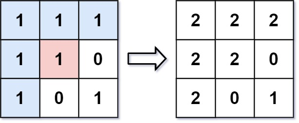

# 733.图像渲染.md

## 题目

有一幅以 m x n 的二维整数数组表示的图画 image ，其中 image[i][j] 表示该图画的像素值大小。

你也被给予三个整数 sr , sc 和 newColor 。你应该从像素 image[sr][sc] 开始对图像进行 上色填充 。

为了完成 上色工作 ，从初始像素开始，记录初始坐标的 上下左右四个方向上 像素值与初始坐标相同的相连像素点，接着再记录这四个方向上符合条件的像素点与他们对应 四个方向上 像素值与初始坐标相同的相连像素点，……，重复该过程。将所有有记录的像素点的颜色值改为  newColor 。

最后返回 经过上色渲染后的图像 。

### 示例 1:



```
输入: image = [[1,1,1],[1,1,0],[1,0,1]]，sr = 1, sc = 1, newColor = 2
输出: [[2,2,2],[2,2,0],[2,0,1]]
解析: 在图像的正中间，(坐标(sr,sc)=(1,1)),在路径上所有符合条件的像素点的颜色都被更改成2。
注意，右下角的像素没有更改为2，因为它不是在上下左右四个方向上与初始点相连的像素点。
```

### 示例 2:

```
输入: image = [[0,0,0],[0,0,0]], sr = 0, sc = 0, newColor = 2
输出: [[2,2,2],[2,2,2]]
```

### 提示:

- m == image.length
- n == image[i].length
- 1 <= m, n <= 50
- 0 <= image[i][j], newColor < 2^16
- 0 <= sr < m
- 0 <= sc < n

## 前言

本题要求将给定的二维数组中指定的「色块」染成另一种颜色。「色块」的定义是：直接或间接相邻的同色方格构成的整体。

可以发现，「色块」就是被不同颜色的方格包围的一个同色岛屿。我们从色块中任意一个地方开始，利用广度优先搜索或深度优先搜索即可遍历整个岛屿。

注意：当目标颜色和初始颜色相同时，我们无需对原数组进行修改。

## 方法一：广度优先搜索

### 思路及算法

广度优先遍历。广度优先顾名思义先考虑循环的广度。例如循环的顺序位上下左右，那么就是先遍历上下左右，然后再遍历上的上下左右、下的上下左右...... 要是广度优先我们一般借助队列（先进先出），顺序遍历上下左右时也将它们按顺序存入队列，当上下左右遍历完时再从队列中取出一个点继续遍历这个点的上下左右......直到队列为空。

我们从给定的起点开始，进行广度优先搜索。每次搜索到一个方格时，如果其与初始位置的方格颜色相同，就将该方格加入队列，并将该方格的颜色更新，以防止重复入队。

注意：因为初始位置的颜色会被修改，所以我们需要保存初始位置的颜色，以便于之后的更新操作。

```
var floodFill = function(image, sr, sc, newColor) {
    let lineLen=image.length, rowLine=image[0].length;
    let oldColor=image[sr][sc];
    let queue=[[sr,sc]];
    //根据题意，当（sr,sc）与newcolor一样时则不需要改变。
    if(oldColor==newColor) return image;

    //BFS;
    while(queue.length){
        const [line, row]=queue.shift();
        image[line][row]=newColor;
        if(line>0&&image[line-1][row]==oldColor)queue.push([line-1,row]);
        if(line<lineLen-1&&image[line+1][row]==oldColor)queue.push([line+1,row]);
        if(row>0&&image[line][row-1]==oldColor)queue.push([line,row-1]);
        if(row<rowLine-1&&image[line][row+1]==oldColor)queue.push([line,row+1]);

    }
    return image;
};
```

### 复杂度分析

- 时间复杂度：O(n×m)，其中 n 和 m 分别是二维数组的行数和列数。最坏情况下需要遍历所有的方格一次。
- 空间复杂度：O(n×m)，其中 n 和 m 分别是二维数组的行数和列数。主要为队列的开销。

## 方法二：深度优先搜索

### 思路及算法

深度优先遍历。深度优先顾名思义先考虑遍历的深度。例如顺序为上下左右，那么就是先遍历上、上的上....上的下.....其实就是二叉树的先序遍历吧。一般借助递归实现深度优先，这使得深度遍历的代码一般比较简单。

我们从给定的起点开始，进行深度优先搜索。每次搜索到一个方格时，如果其与初始位置的方格颜色相同，就将该方格的颜色更新，以防止重复搜索；如果不相同，则进行回溯。

注意：因为初始位置的颜色会被修改，所以我们需要保存初始位置的颜色，以便于之后的更新操作。

### 代码

```
/**
 * @param {number[][]} image
 * @param {number} sr
 * @param {number} sc
 * @param {number} newColor
 * @return {number[][]}
 */
var floodFill = function(image, sr, sc, newColor) {
    let lineLen=image.length, rowLine=image[0].length;
    let oldColor=image[sr][sc];
    //根据题意，当（sr,sc）与newcolor一样时则不需要改变。
    if(oldColor==newColor) return image;

    ///DFS
    const DFS=(line,row)=>{
        if(line<0||line>=lineLen||row<0||row>=rowLine||image[line][row]!=oldColor)return false;
        image[line][row]=newColor;
        DFS(line-1,row);
        DFS(line+1,row);
        DFS(line,row-1);
        DFS(line,row+1);
    }
    DFS(sr,sc);
    return image;
};
```

### 复杂度分析

- 时间复杂度：O(n×m)，其中 n 和 m 分别是二维数组的行数和列数。最坏情况下需要遍历所有的方格一次。
- 空间复杂度：O(n×m)，其中 n 和 m 分别是二维数组的行数和列数。主要为栈空间的开销。
