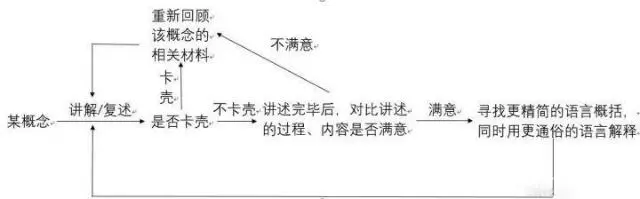

# JavaScript 设计原则与设计模式

## 前言

**费曼学习法：**

给别人讲述知识时可以发现自己掌握的是否牢固透彻，写的过程不断发现自己的不足，然后通过一些方式来解决问题，这也是一种学习过程；当然，写文章给别人看，也要从读者的角度出发，考虑他们想要从这篇文章获得什么，还有就是你想表达些什么给读者

学习设计原则设计模式的好处、介绍设计原则和设计模式、常用设计模式的实践、代码重构的具体方法、一些问题一些思考。你可以先读一遍带着疑问去阅读这本书籍看看是否有助于你理解。

## 一、为什么要学习设计原则、设计模式

首先，设计原则、设计模式受用的目标人群是有一定的 js 基础且有一定的项目实践经历的开发者，不然的话，就算学习设计也是生搬硬套，收货甚微，当有了一定基础及实践之后，阅读本书之后有三种感觉：

1. 你的某些代码就是书上的反例，有醍醐灌顶的感觉
2. 你的某些代码已经实践了某些设计模式遵从了某些设计原则，但是你并不知道这样写代码是叫这个模式以及这个模式的全部优缺点或者你的代码还有更进一步优化的空间
3. JavaScript 设计原则以及设计模式都只属于软件设计的一部分，但这意味着已经开始脱离了 API 调用工程师‘的称号，开始接触编程思想，但是设计原则跟模式有限，只针对于代码层面。

## 二、JavaScript 常用设计原则

1. 单一职责原则 SRP
2. 最少知识原则 LKP
3. 开放-封闭原则 OCP

## 三、常用设计模式

1. 单例模式
2. 代理模式
3. 策略模式
4. 状态模式
5. 享元模式
6. 职责链模式
7. 装饰者模式
8. 发布-订阅模式

## 四、编程技巧

1. 提炼函数
2. 合并重复的条件片段
3. 把条件分支语句提炼成函数
4. 合理使用循环
5. 提前让函数退出代替嵌套条件分支
6. 传递对象参数代替过长的参数列表（面向对象编程--编程模式--配置对象）
7. 尽量减少参数数量
8. 少用三目运算符（三元运算符）
9. 合理使用链式调用
10. 分解大型类
11. 用 return 退出多重循环

## 五、结语
