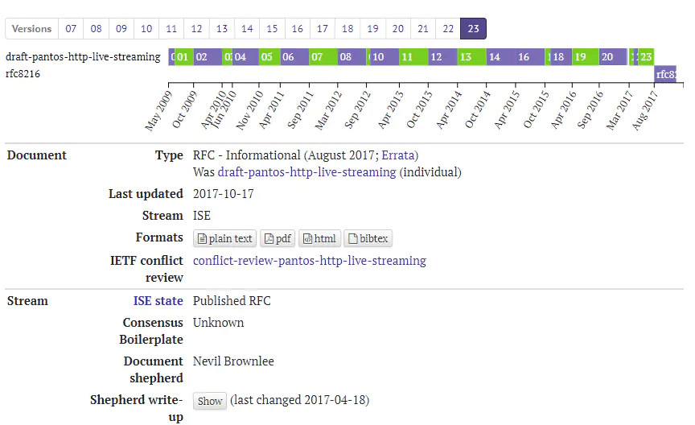
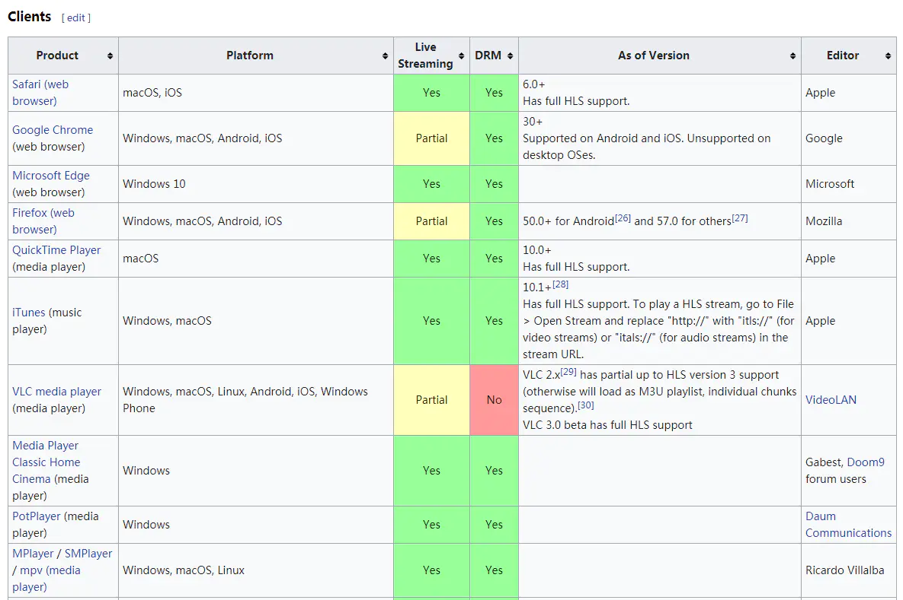
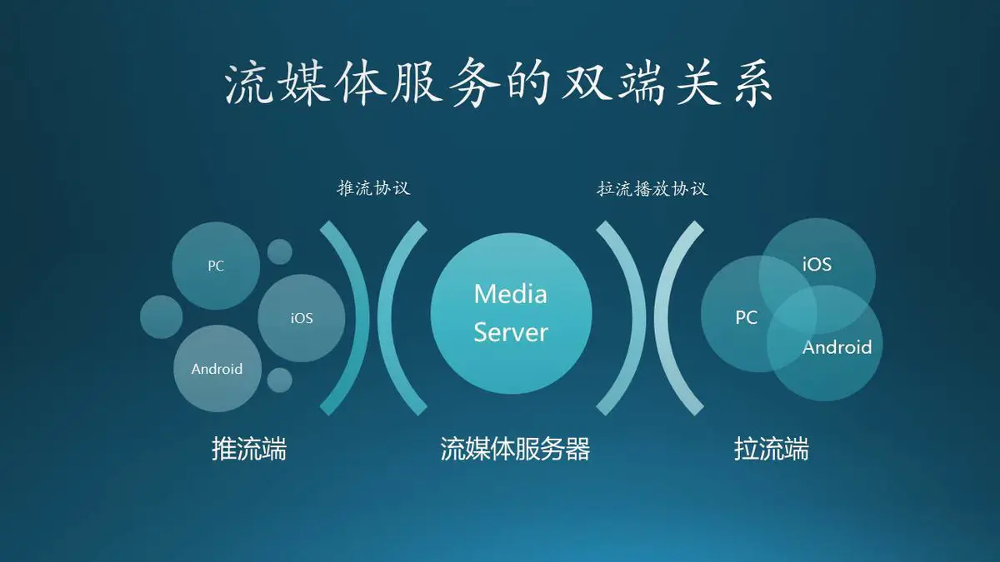
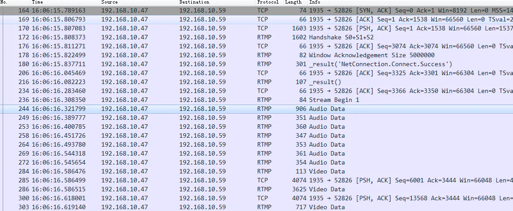
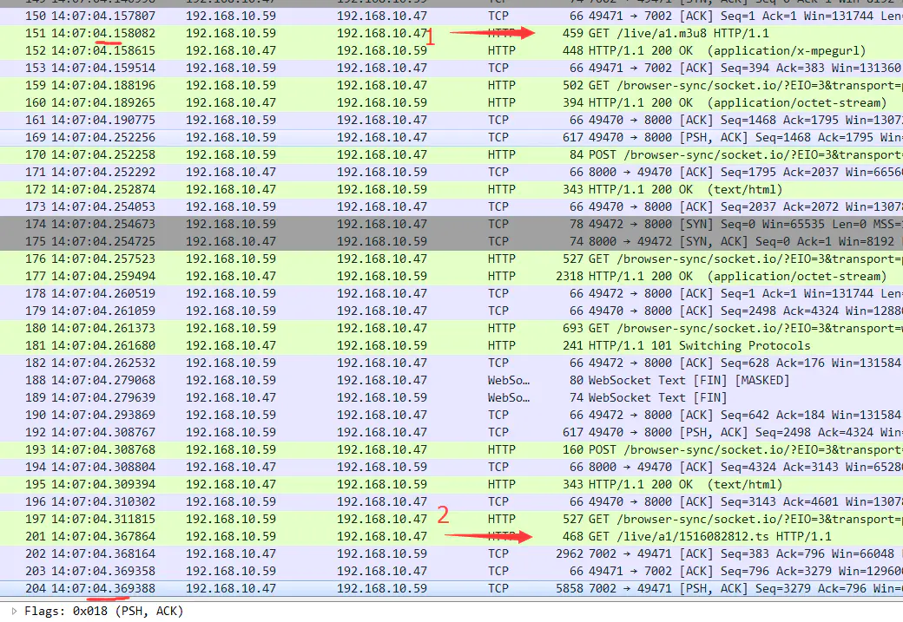
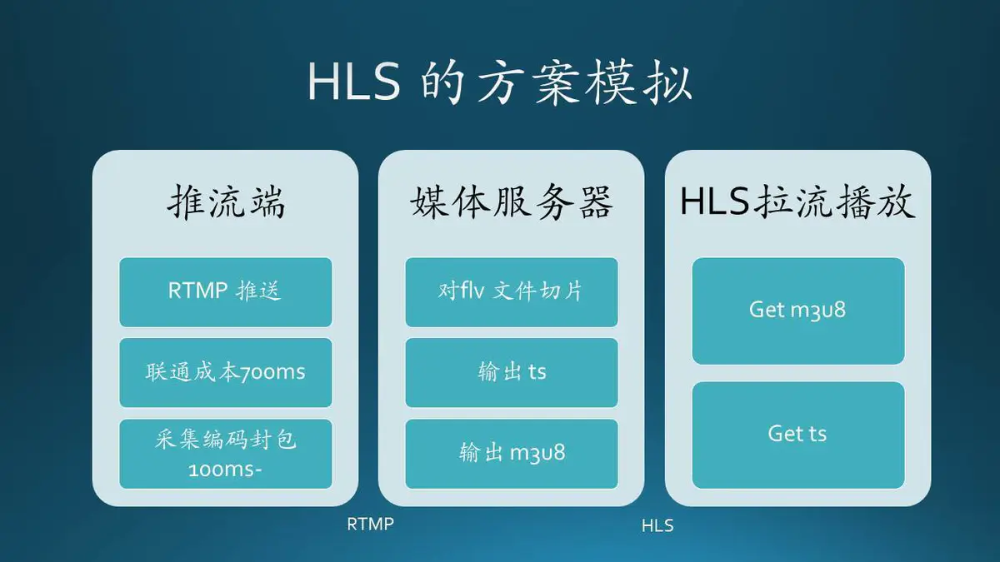
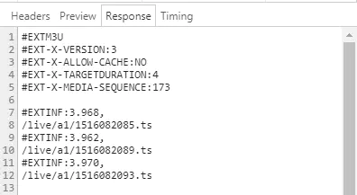
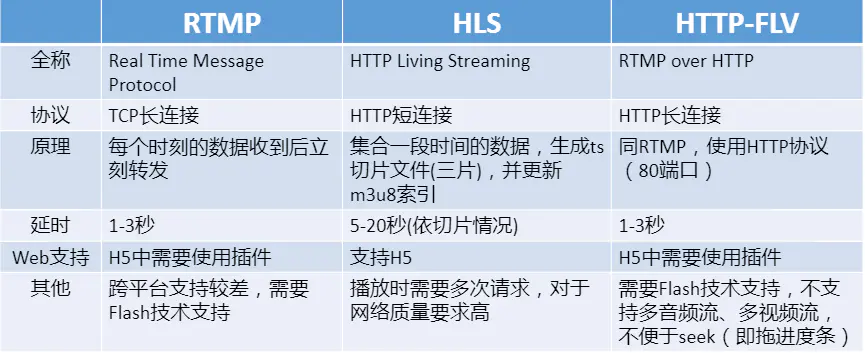

# 理解 RTMP、HttpFlv 和 HLS 的正确姿势

## 前言

需求比协议重要，理解你的需求在前，选择应用的协议在后！

## 第一、是什么？

协议是为了解决问题而生的，它有着天然的指向性。同时，也有着它自身的局限。

### 关于 RTMP

Macromedia 创造了 RTMP 协议，一个实时消息传输协议，一个让在线看片成为可能得协议

2012 年， Adobe 正式发布 RTMP specification v1.0 的时候。本以为拿着媒体服务的金钥匙，可以在未来世界纵横驰骋。但 Adobe 错了，未来已来，但那是一个 Html5 的世界，一个不需要 Flash 的世界。

### 关于 HttpFlv

HttpFlv 的出现最早是 2008 年，从它的协议本身我们能看到 Adobe 的影子，就是 flv 协议本身。也可以说，httpflv 是争夺与放弃之间妥协的产物。人们再也不愿意看到 Adobe，但又不得不面对海量 Flv 历史文档。在仇恨与无奈的交织中，httpflv 诞生了。

HttpFlv 就是 http+flv ，将音视频数据封装成 FLV 格式，然后通过 HTTP 协议传输给客户端。

虽然传输协议变了，但在 flv 数据格式下，脱离 FlashPlayer 还是无稽之谈。但在 2016 年，这一切都发生了改变，因为 flv.js 问世了！

Bilibili，也就是传说中的 B 站，不仅贡献了弹幕，为我们提供了另一种观影交互体验。更重要的，Flv.js 的诞生，让我们在视频播放领域彻底告别 Adobe 时代。一个全新、干净的 HTML5 就这样向我们走来了。

### 关于 HLS

现实世界就是这么残酷，伴随协议更迭的，是一个巨头倒下，另一个巨头崛起的故事。谈 HLS 就不得不谈苹果，谈苹果就不得不提乔帮主。

HLS 就是“HTTP Live Streaming”的缩写，它诞生自 2009 年，QuickTime 和 iPhone3GS 黄金搭档下的一个标准，一个意在颠覆流媒体产业的新协议。

它的工作原理简单来说就是把一段视频流，分成一个个小的基于 HTTP 的文件来下载。当媒体流正在播放时，客户端可以根据当前网络环境，方便地在不同的码率流中做切换，以实现更好的观影体验。

HLS 的出现是为了解决苹果原生环境中的流媒体播放，这个协议可以方便地让 Mac 和 iPhone 播放视频流，不依赖 Adobe，更不用去管什么标准委员会。依赖自己，永远是最大力量的保障。

就苹果来说，HLS 经过 10 年的发展，RFC 8216 发布了 HLS 的第七个版本。Adobe 早已是昨日黄花，未来已来，这是一个 Html5 的世界。在视频播放领域，全民直播已经开启，这是一个实时性需求强于稳定性的播放环境。HLS 的时延要比 HTTP-FLV 高。

## 第二、为什么？

在一个完整的流媒体服务框架中，角色就是"两端加一服"。推流端、拉流端加上媒体服务器。

同时按照应用场景的不同，协议又分：

- 推流协议；
- 拉流播放协议；

大部分教程在介绍这三个协议的时候，都忽略了一点，就是协议的应用场景到底是什么？ RTMP 可以用在双端，但 HLS 只能用在拉流端，记住这层关系。

### （一）带着问题找答案：为什么 RTMP 比 HLS 快？

首先，这个问题发生在拉流端，协议也都是拉流协议。分别对 RTMP 和 HLS 的拉流播放进行抓包，能得到以下两张截图。

RTMP

HLS

通过报文数据我们能看出：

- 在 RTMP 下，从 Handshake 到第一个 VideoData 用了 700ms 的时间；
- 在 HLS 下，从 Get m3u8 到 response ts Data 只有 300ms！

问题来了，HLS 的响应效率这么高，怎么就比 RTMP 还慢了呢？这都要从 HLS 的实现方案说起。

在上图的生产环境中，以 RTMP 协议推流，HLS 拉流。端到端的时间消耗是：

- RTMP 推流端的联通成本是 700ms ，注意此时的 700 毫秒包含了 connect 和 send Video Data ；
- 推流端联通之后的时间成本，主要是采集编码封包的成本，不需要再次 connect；
- HLS 的请求响应成本是 300ms；
- flv to ts 的成本，用 ffmpeg 切一个 10 秒的码率 500 的视频，算上磁盘的写入时间最多 200ms；

所以说，HLS 的慢的原因只有一个，就是等数据！

以 demo 中的这个 m3u8 来说，在直播的环境里媒体服务器要等到这 12 秒的数据推上来，我才有可能输出。即使切片成本降为零，拉流端看到的数据也是 12 秒之前的内容。

能不能优化？能！

缩短 ts 间隔与个数，HLS 也能做到 3 秒+的延迟。但这个结果也拼不过 RTMP 这种不需切片的解决方案。

## 第三、怎么选？

