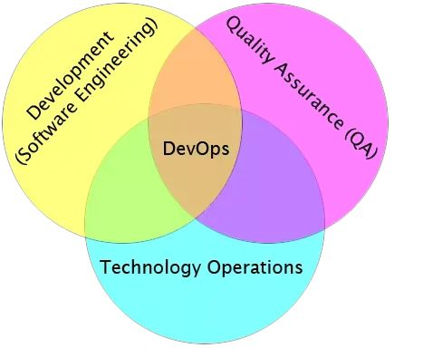
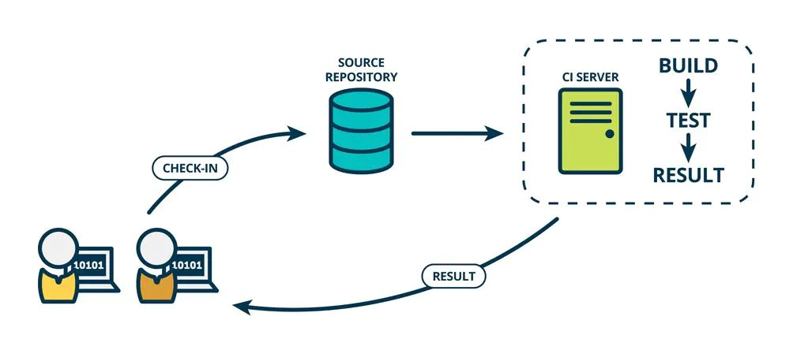
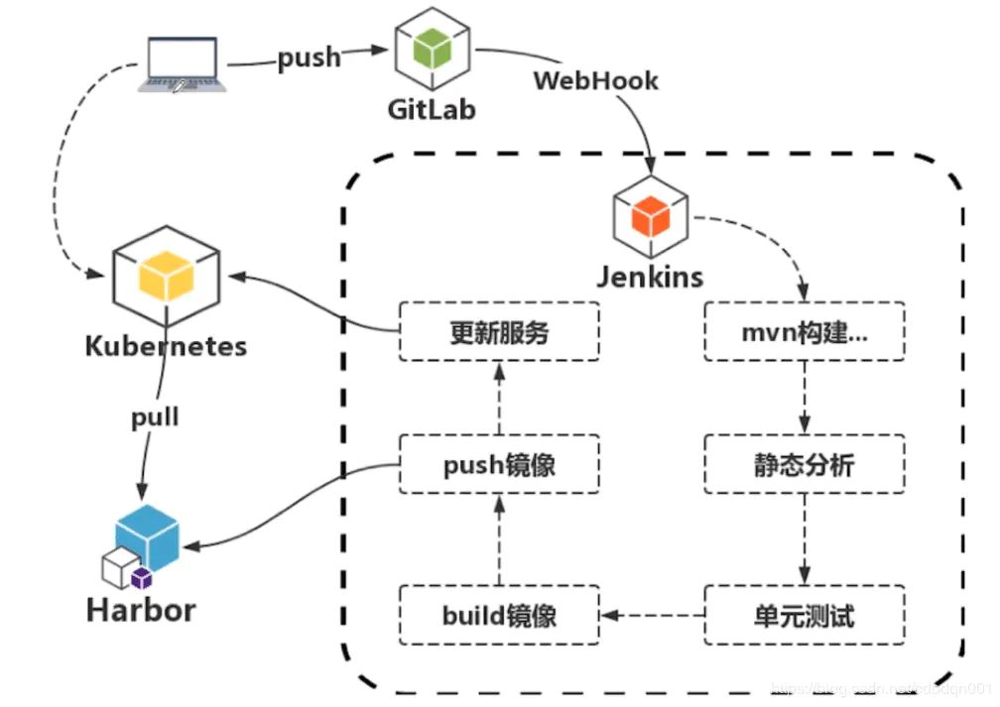
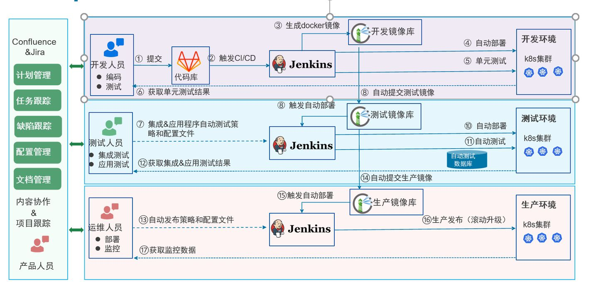
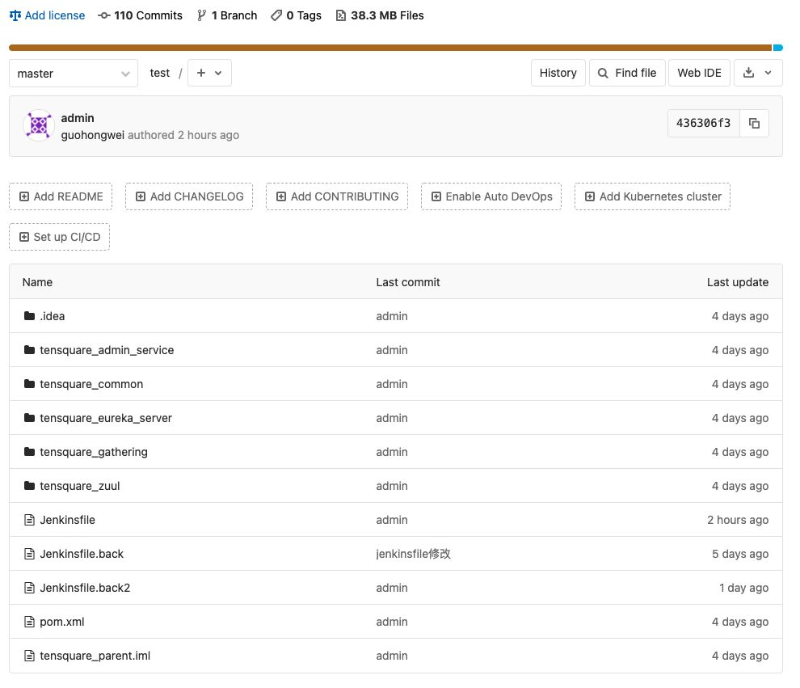
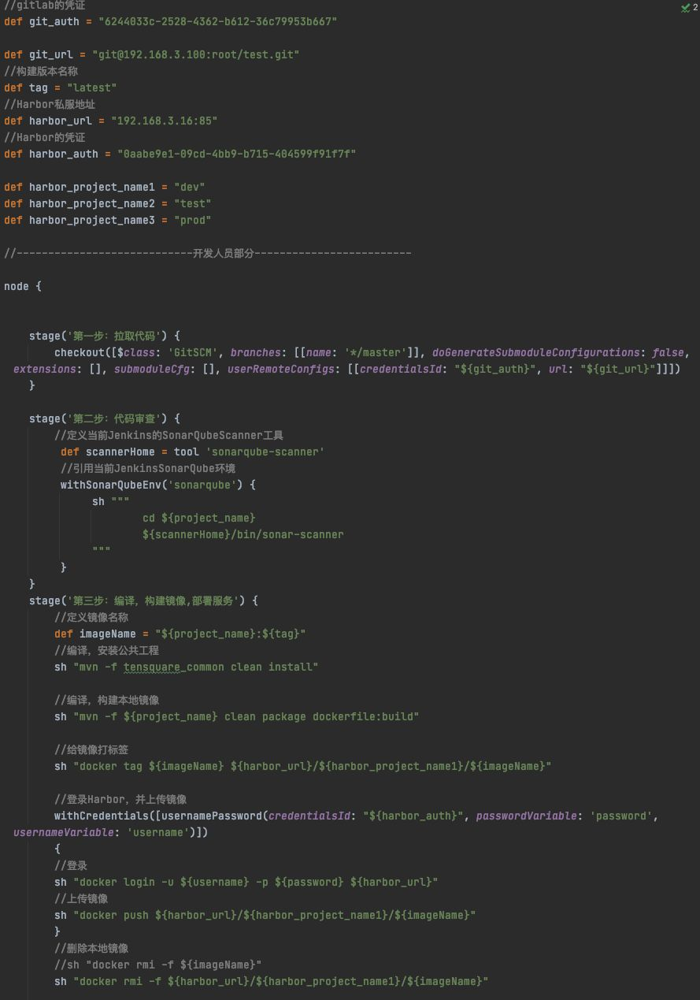
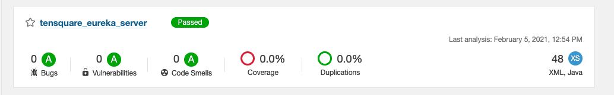
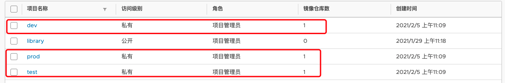
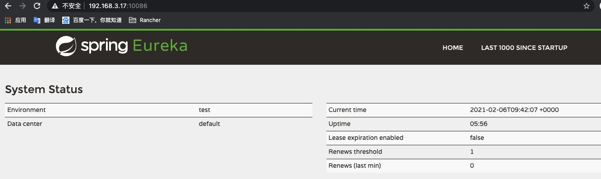

# 
DevOps 和 CI/CD

<!-- START doctoc generated TOC please keep comment here to allow auto update -->
<!-- DON'T EDIT THIS SECTION, INSTEAD RE-RUN doctoc TO UPDATE -->

**Table of Contents** _generated with [DocToc](https://github.com/thlorenz/doctoc)_

- [
DevOps 和 CI/CD
](#centerdevops-和-cicdcenter)
  - [一、DevOps 简介](#一devops-简介)
    - [DevOps 落地困境包括：](#devops-落地困境包括)
  - [二、CI/CD 简介](#二cicd-简介)
    - [持续集成 CI](#持续集成-ci)
    - [持续部署 CD](#持续部署-cd)
  - [三、实现 DevOps 需要什么](#三实现-devops-需要什么)
  - [四、Jenkins 常用插件及功能](#四jenkins-常用插件及功能)
    - [（一）用户及权限](#一用户及权限)
    - [（二）代码管理](#二代码管理)
    - [（三）项目及视图](#三项目及视图)
    - [（四）构建触发](#四构建触发)
    - [（五）构建参数](#五构建参数)
    - [（六）构建任务及环境](#六构建任务及环境)
    - [（七）构建通知](#七构建通知)
    - [（八）容器化 Slave](#八容器化-slave)
    - [（九）Admin 相关插件](#九admin-相关插件)
  - [五、Docker、Kubernetes 的 CI/CD 实现思路](#五dockerkubernetes-的-cicd-实现思路)
    - [流程](#流程)
    - [实际 Demo](#实际-demo)

<!-- END doctoc generated TOC please keep comment here to allow auto update -->

## 一、DevOps 简介

DevOps 就是开发（Development）、测试（QA）、运维（Operations）这三个领域的合并。

DevOps 是一种思想、一组最佳实践、以及一种文化。DevOps 落地实施，从组织架构、设计人员、流程、人员分工、人员技能到工具，变化很大，要求很高，完全颠覆了现有的开发运维模式，建设风险很高

### DevOps 落地困境包括：

1. 涉及的部门多（开发中心、质量控制部门、生产运行部门）；
2. 流程改造复杂；
3. 责任边界需要重新划分；
4. 自动化是核心问题。

## 二、CI/CD 简介

### 持续集成 CI

在传统软件开发过程中，集成通常发生在每个人都完成了各自的工作之后。在项目尾声阶段，通常集成还要痛苦的花费数周或者数月的时间来完成。持续集成是一个将集成提前至开发周期的早期阶段的实践方式，让构建、测试和集成代码更经常反复地发生。

开发人员通常使用一种叫做 CI Server 的工具来做构建和集成。持续集成要能够自测代码。分别测试各自代码来保证它能够正常工作，这些测试通常被称为单元测试（Unit tests）。

代码集成以后，当所有的单元测试通过后，会进行绿色构建（green build）。这表明他们已经成功地集成在一起，代码正按照测试预期地在工作。

### 持续部署 CD

持续交付是持续集成的延伸，而持续部署又是持续交付的延伸，通常将不同环境发布和测试过程称为部署流水线，并把部署到生产环境的过程实现自动化。

DevOps 是 CICD 思想的延伸，CICD 是 DevOps 的基础核心，如果没有 CICD 自动化的工具和流程，DevOps 是没有意义的。

## 三、实现 DevOps 需要什么

如下列举了常用的实现 DevOps 的工具，在实际的生产过程中通常只会使用其中的一部分产品。

1. 代码管理（SCM）：`GitHub`、`GitLab`、BitBucket、SubVersion
2. 自动部署：Capistrano、CodeDeploy
3. 持续集成（CI）：Bamboo、Hudson、`Jenkins`
4. 配置管理：Ansible、Chef、Puppet、SaltStack、ScriptRock GuardRail
5. 容器：`Docker`、LXC、第三方厂商如 AWS
6. 编排：`Kubernetes`、Core、Apache Mesos、DC/OS
7. 服务注册与发现：`Zookeeper`、`etcd`、Consul
8. 脚本语言：python、ruby、`shell`
9. 日志管理：`ELK`、Logentries
10. 系统监控：Datadog、Graphite、Icinga、Nagios
11. 性能监控：AppDynamics、New Relic、Splunk
12. 压力测试：`JMeter`、Blaze Meter
13. 预警：PagerDuty、pingdom、厂商自带如 AWS SNS
14. HTTP 加速器：Varnish
15. 消息总线：ActiveMQ、SQS
16. 应用服务器：`Tomcat`、JBoss
17. Web 服务器：`Apache`、`Nginx`、IIS
18. 数据库：`MySQL`、Oracle、PostgreSQL 等关系型数据库；cassandra、mongoDB、redis 等
19. NoSQL 数据库
20. 构建工具：Ant、Gradle、`maven`

## 四、Jenkins 常用插件及功能

### （一）用户及权限

Jenkins 用户权限管理是 Jenkins Administration 中非常很重要的环节，由于大部分企业都会有自己的域控管理，所以和 LDAP 集成并基于用户组实现权限模型设计与管理是企业级 Jenkins 实践的重要内容。

1. l LDAP （https://plugins.jenkins.io/ldap），这个插件允许使用LDAP对用户进行认证，LDAP 服务器可以为 Active Directory 或者 OpenLDAP。
2. l Active Directory https://plugins.jenkins.io/active-directory，这个插件允许使用Active Directory 对用户进行认证，同时结合诸如 Matrix Authorization Strategy 插件，可以识别用户所在的所有用户组，对用户授权进行灵活配置。
3. l 基于 Windows Active Directory 进行域管理的企业，推荐采用 Active Directory。
4. l GitHub Authentication https://plugins.jenkins.io/github-oauth，这个插件提供了使用GitHub进行用户认证和授权的方案。
5. l Gitlab Authentication https://plugins.jenkins.io/gitlab-oauth，这个插件提供了使用GitLab进行用户认证和授权的方案。
6. l Matrix Authorization Strategy https://plugins.jenkins.io/matrix-auth，这个插件提供了基于矩阵的授权策略，支持全局和项目级别的配置。
7. l Role-based Authorization Strategy https://plugins.jenkins.io/role-strategy，这个插件提供了一种基于角色（Role）的用户权限管理策略，支持创建global角色、Project角色、Slave角色，以及给用户分配这些角色。这款插件是最常用的Jenkins权限策略和管理插件。

### （二）代码管理

Jenkins 项目中配置 Source Code Management 去下载代码进行构建任务，是非常普遍的应用场景。Jenkins 插件支持很多 SCM 的系统，使用最常见的是 Git 和 SVN。

1. l Git https://plugins.jenkins.io/git，支持使用Github、GitLab、Gerrit等系统管理代码仓库。
2. l Subversion https://plugins.jenkins.io/subversion，支持Subversion系统管理源代码。

### （三）项目及视图

Jenkins 中对 Project 和 view 的管理，是用户日常工作中使用很多的功能。

1. l Folder https://plugins.jenkins.io/cloudbees-folder，这个插件支持用户使用目录管理项目，目录支持嵌套，并且支持目录中创建视图。
2. l List view Jenkins 默认支持 List 类型的视图，用户可以创建 List 视图过滤所关心的项目。
3. l Sectioned View https://plugins.jenkins.io/sectioned-view，这个插件支持一种新的视图，视图可以分为多个部分，每部分可以单独配置显示所选择的项目信息。
4. l Nested View https://plugins.jenkins.io/nested-view，这个插件支持一种新的视图，其表示直接显示项目，而是以目录图标显示所包含的子视图，每个子视图显示所选项目信息。
5. l Build Pipeline https://plugins.jenkins.io/build-pipeline-plugin，这个插件提供了一种Build Pipeline 视图，用于显示上、下游项目构建的关系。

### （四）构建触发

Jenkins 支持多种 Build 触发方式，尤其一些自动化触发方式非常有用

1. l Build periodically，Jenkins 内置功能，可以设置类似 crontab 时间，周期性地自动触发构建。
2. l Poll SCM，Jenkins 内置功能，类似 Build periodically，可以设置类似 crontab 时间，不同的是不是直接进行构建，而是周期性地在后台检查所配置的 SCM 有没有更新，只有当有代码更新时才会触发构建。
3. l Trigger builds remotely (e.g., from scripts)，Jenkins 内置功能，远程触发构建，通过设置 token 可以支持远程脚本中触发 Jenkins 构建。
4. l Gerrit Trigger https://plugins.jenkins.io/gerrit-trigger，这个插件将Jenkins集成到Gerrit code review 中，支持 Jenkins 配置 Gerrit 服务器等信息，实现 Gerrit event 触发 Jenkins 构建。
5. l GitLab https://plugins.jenkins.io/gitlab-plugin， 这个插件将 Jenkins 集成到 GitLab web hook 中，支持 Gitlab 分支及 Merge Request 等相关事件触发 Jenkins 构建。
6. l GitHub Integration https://plugins.jenkins.io/github-pullrequest ，这个插件将 Jenkins 集成到 GitHub 中，支持 Gitgub 分支及 Pull requests 触发 Jenkins 构建。
7. l JIRA Trigger https://plugins.jenkins.io/jira-trigger，这个插件将Jenkins集成到Jira WebHooks 中，支持 Jira issue 的状态等变化时触发 Jenkins 构建。

### （五）构建参数

Jenkins 除了支持普通的参数类型（布尔型、字符串型、多行文本型、选择型和文件型 ）外，还有一些插件支持更加丰富实用的参数类型，比如参数间动态关联、多层级参数、隐藏参数等 。

1. l nodelabelparameter https://plugins.jenkins.io/nodelabelparameter，这个插件增加了一个新的参数类型，Node 和 Label，从而使用户通过参数可以选择项目构建运行的节点。
2. l 其他插件不一一列举，可以查看插件说明。

### （六）构建任务及环境

围绕构建任务，有许多小的插件。

1. l Workspace Cleanup https://plugins.jenkins.io/ws-cleanup，这个插件支持在构建前后 删除或者部分删除 workspace
2. l description setter https://plugins.jenkins.io/description-setter，这个插件支持正则表达式匹配构建log输出，设置构建的描述
3. l build-name-setter https://plugins.jenkins.io/build-name-setter，这个插件支持设置构建的显示名字，而不是默认的为#1，#2，……，#buildnum
4. l Environment Injector https://plugins.jenkins.io/envinject，这个插件支持在构建任务的不同阶段插入环境变量，并且在构建结束导出所有的环境变量等功能。

### （七）构建通知

构建状态及时地通知用户，是 Jenkins 的一个必不可少的功能。Jenkins 支持多种主动和被动的通知方式。

1. l Mailer https://plugins.jenkins.io/mailer，这个插件支持基本的邮件通知功能，比如构建失败和构建恢复成功可以发送邮件通知给相关人员。
2. l Email Extension https://plugins.jenkins.io/email-ext，这个插件是邮件通知的扩展，支持定制邮件内容，触发条件以及邮件接收者，功能比基本邮件通知要灵活强大的多。
3. l Slack Notification https://plugins.jenkins.io/slack，这个插件支持把构建结果推送到Slack channel。

### （八）容器化 Slave

Jenkins 的 Master-Slave 架构实现了分布式构建，可以充分的横向扩展 Slave 来提升构建能力，将 Slave 容器化是目前主流的构建环境标准化、集群化和弹性化的方式。

1. l https://plugins.jenkins.io/docker-plugin，这个插件可以配置docker host ，从而动态的提供 Jenkins Agent（Slave），运行构建后再销毁这个 slave。
2. l https://plugins.jenkins.io/kubernetes， 这个插件支持利用 Kubernetes cluster 动态的提供 Jenkins Agent（Slave），利用 Kubernetes 调度机制来优化 Jenkins 负载等。

### （九）Admin 相关插件

1. l Configuration Slicing https://plugins.jenkins.io/configurationslicing，这个插件支持批量修改项目配置
2. l Mask Passwords https://plugins.jenkins.io/mask-passwords，这个插件支持遮挡构建log输出的password等敏感信息
3. l Backup https://plugins.jenkins.io/backup，这个插件添加备份功能到Jenkins management

## 五、Docker、Kubernetes 的 CI/CD 实现思路

### 流程

由客户端（开发人员）将代码 push 推送到 git 仓库，gitlab 上配置了一个 webHook 的来触发 Jenkins 的构建。进入到 Jenkins 虚线范围内，它所做的事情非常多，从 mvn 构建代码，对代码进行静态分析，做单元测试，测试通过之后就可以 build 镜像，镜像构建成功后就把镜像 push 推送到 Harbor 镜像仓库中，镜像 push 推送到镜像仓库后，就可以调用 kubernetes 集群的 restAPI 更新服务，而后 kubernetes 接收到了更新的指令，从 Harbor 镜像仓库 pull 拉取镜像，从

1. 开发从镜像库里获取基础镜像，对应用进行容器化开发；
2. 开发提交代码到 Gitlab（在 Kubernetes 中实现 Gitlab 服务，并通过持久化存储保存用户数据）；
3. Gitlab 收到代码提交请求后通过 webhook 触发 Jenkins master
4. Jenkins master 收到请求后在 slave 节点中对源码进行打包；
5. 在源码打包完成后根据流水线，从 Gitlab 中获取 dockerfile，在 slave 节点中生成 docker images；
6. Docker 镜像生成之后上传到 Docker 私有仓库 harbor；
7. 通过 Jenkins 流水线在 Kubernetes 测试环境拉取镜像，部署应用；
8. 测试成功之后，通过 Jenkins 流水线在 Kubernetes 生产环境进行应用的部署上线。

### 实际 Demo

落地流程图（Pipline 标准化流程图）

1. GitLab

2. Jenkins

3. Sonarqube

4. Harbor

5. Docker

6. Kubernetes

