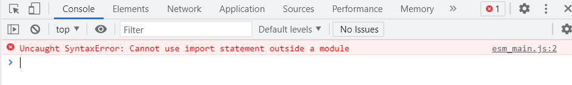

# <center>ESM</center>

## ESM 是什么？

ESM 是将 Javascript 程序拆分成多个单独模块，并能按需导入的标准。

和 webpack，babel 不同的是，esm 是 javascript 的标准功能，在浏览器端和 nodejs 中都已得到实现。`使用 esm 的好处是浏览器可以最优化加载模块，比使用库转化更有效率。`

ESM 标准通过 import, export 语法实现模块变量的导入和导出。

## ESM 模块的特点

1. 存在模块作用域，顶层变量都定义在该作用域，外部不可见
2. 模块脚本自动采用严格模式
3. 模块顶层的 this 关键字返回 undefined
4. esm 是编译时加载，也就是只有所有 import 的模块都加载完成，才会开始执行
5. 同一个模块如果加载多次，只会执行一次

## 各语句意义

### 1. export

export 语句用来导出模块中的变量

```
// 导出变量
export let count = 1;
export const CONST_VAR = 'CONST_VAR';
// 导出函数
export function incCount() {
    count += 1;
}
// 导出类
export class Demo {

}

function add(x) {
    return x + count;
}
// 使用export导出一组变量
export {
    count,
    add,
    // 使用as重命名导出的变量
    add as addCount,
}

// 导出default
export default add

// 合并导出其他模块的变量
export { name } from './esm_module2.js'
export * from './esm_module2.js'
```

### 2. import

import 语句用来导入其他模块的变量

```
// 导入变量
import { count, incCount, CONST_VAR } from './esm_module1.js';

// 通过as重命名导入的变量
import { addCount as renamedAddCount } from './esm_module1.js';

// 导入默认
import { default as defaultAdd } from './esm_module1.js';
import add from './esm_module1.js';

// 创建模块对象
import * as module1 from './esm_module1.js';
```

### 3. export 导出的是值引用

esm 模块和 commonjs 模块的一个显著差异是，cjs 导出的是值得拷贝，esm 导出的是值的引用。当模块内部的值被修改时，cjs 获取不到被修改后的值，esm 可以获取到被修改后的值。

cjs 例子

```
// cjs_module1.js
var count = 1;
function incCount() {
    count += 1;
}

module.exports = {
    count: count,
    incCount: incCount,
}

// cjs_demo.js
var { count, incCount } = require('./cjs_module1.js');

console.log(count); // 1
incCount();
console.log(count); // 1
```

esm 例子

```
// esm_module1.js
let count = 1;
function incCount() {
    count += 1;
}

export {
    count,
    incCount,
}

// esm_demo.js
import { count, incCount } from './esm_module1.js';

console.log(count); // 1
incCount();
console.log(count); // 2
```

从实现原理上来看，cjs 的 module.exports 是一个对象，在运行期注入模块。在导出语句 module.exports.count = count 执行时，是给这个对象分配一个 count 的键，并赋值为 1。 这之后模块中的 count 变量再怎么变化，都不会干扰到 module.exports.count

esm 中的 export { count }是导出了 count 变量的一个只读引用，等于说使用者读取 count 时，值的指向还是模块中 count 变量的值。

## 在 html 中使用 esm

使用 script 标签引入 esm 文件，同时设置 type=module，标识这个模块为顶级模块。浏览器将 esm 文件视为模块文件，识别模块的 import 语句并加载。

```
<script src="./esm_main.js" type="module"></script>
```

如果不设置 type=module，浏览器认为该文件为普通脚本。检查到文件中存在 import 语句时，会报如下错误



## esm 的加载机制

esm 标准没有规定模块的加载细节，将这些留给具体环境实现。大致上分为下面四个步骤：

1. 解析：实现读取模块的源代码并检查语法错误。
2. 加载：递归加载所有 import 的模块。
3. 链接：对每个加载的模块，都生成一个模块作用域，该模块下的所有全局声明都绑定到该作用域上，包括从其他模块导入的内容
4. 运行时：完成所有 import 的加载和链接，脚本运行每个已经加载的模块中的语句。当运行到全局声明时，什么也不会做（在链接阶段已经将声明绑定到模块作用域）。

推荐深入 ESM 文章：[ES6 In Depth: Modules](https://hacks.mozilla.org/2015/08/es6-in-depth-modules/)

## 动态加载模块

ESM 的一个重要特性是编译时加载，这有利于引擎的静态分析。加载的过程会先于代码的执行。却也导致 import 导入语句不能在函数或者 if 语句中执行

```
// 报语法错误
if (true) {
    import add from './esm_module1.js';
}
```

es2020 提案引入 import()函数，用来动态加载模块，并且可以用在函数和 if 语句中。

```
import('./esm_module1.js')
  .then(module => {
    console.log(module);
  })
```

import()函数接受要加载的模块相对路径，返回一个 Promise 对象，内容是要加载的模块对象。

使用 import()函数还可以实现根据变量动态加载模块

```
async function getTemplate(templateName) {
	let template = await import(`./templates/${templateName}`);
	console.log(template);
}

getTemplate("foo");
getTemplate("bar");
getTemplate("baz");
```
