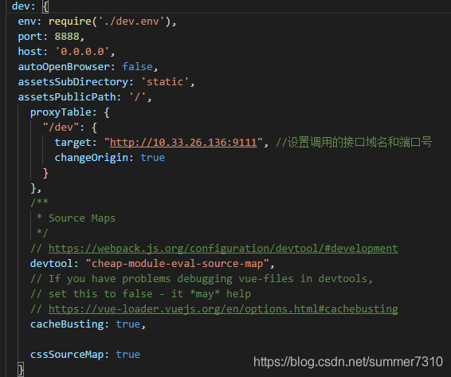
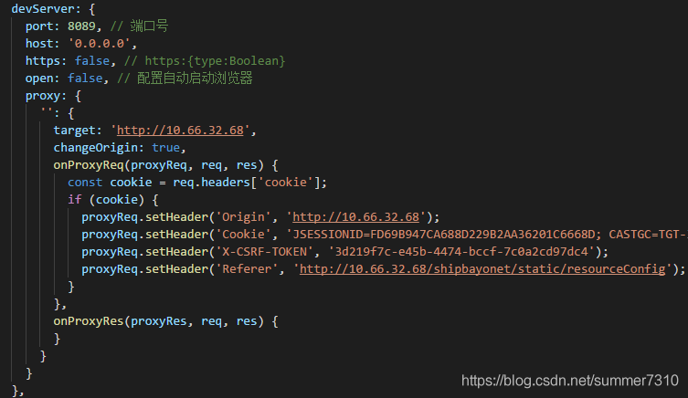

# webpack 开发不同代理方式设置 cookies

## 一、使用 vue-cli 2.x 脚手架开发配置

```
 dev: {
   	env: require('./dev.env'),
    port: 8888,
    host: '0.0.0.0',
    autoOpenBrowser: false,
    assetsSubDirectory: 'static',
    assetsPublicPath: '/',
    proxyTable: {
      "/dev": {
        target: "http://10.33.26.136:9111", //设置调用的接口域名和端口号
        changeOrigin: true
      }
    },
    /**
     * Source Maps
     */
    // https://webpack.js.org/configuration/devtool/#development
    devtool: "cheap-module-eval-source-map",
    // If you have problems debugging vue-files in devtools,
    // set this to false - it *may* help
    // https://vue-loader.vuejs.org/en/options.html#cachebusting
    cacheBusting: true,

    cssSourceMap: true
  }

```



### Cookies 解决方案

当项目开启单点登陆时，需要在接口加上 cookies 和 token


## 二、使用 vue-cli 3.x 脚手架开发配置

Vue CLI 提供了一个 proxy 选项，用来代理接口转发流量。我们可以在根目录下新增 vue.config.js 文件，添加如下的配置：

```
module.exports = {
  devServer: {
    proxy: {
      '/api': {
        target: 'https://10.66.32.68:8340',
        changeOrigin: true
      }
    }
  }
}

```


### cookies 解决方案

解决 Cookies 只需要在登录时将 Vue CLI Proxy 代理的 API 返回头部中 Cookies 写到本地域下。之后再请求其他接口时，读取请求头里面的 Cookies 的值，并附带在实际请求接口的头部，就完成了我们的设想。

```
module.exports = {
  devServer: {
    proxy: {
      '/api': {
        target: 'https://10.66.32.68',
        changeOrigin: true,
        onProxyReq (proxyReq, req, res) {
          originHost = req.headers['x-forwarded-for']
          const cookie = req.headers['cookie']
          if (cookie) {
            proxyReq.setHeader('cookie', cookie)
          }
        },
        onProxyRes(proxyRes, req, res) {
          if (proxyRes.headers['set-cookie']) {
            // 域名信息与实际业务相关
            proxyRes.headers['set-cookie'] = proxyRes.headers['set-cookie'].map(v => {
              return v.replace('domain=.mufeng.me', 'domain=' + originHost.split(':')[0])
            })
          }
        }
      }
    }
  }
}

```


