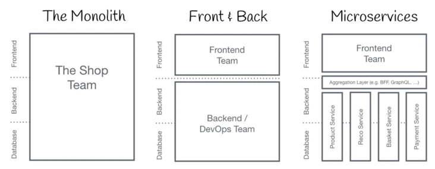
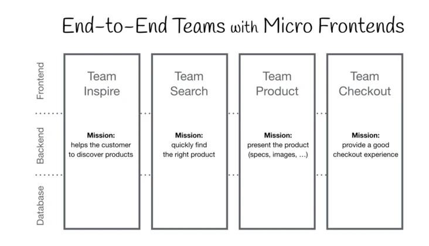

# 
美业微前端的落地

## 前言

2020 年 4 月，有赞美业的前端团队历经 7 个月时间，完成了美业 PC 架构从单体 SPA 到微前端架构的设计、迁移工作。PPT 在去年 6 月份就有了，现在再整理一下形成文章分享给大家。

## Part 01 “大话”微前端

### （一）微前端是什么

这张图，展示了软件开发前端后分工的三个时期：

1. 单体应用：在软件开发初期和一些小型的 Web 网站架构中，前端后端数据库人员存在同一个团队，大家的代码资产也在同一个物理空间，随着项目的发展，我们的代码资产发展到一定程度就被变成了巨石。
   
2. 前后端分离：前端和后端团队拆分，在软件架构上也有了分离，彼此依靠约定去协作，大家的生产资料开始有了物理上的隔离。
   
3. 微服务化：后端团队按照实际业务进行了垂直领域的拆分单一后端系统的复杂度被得到分治，后端服务之间依靠远程调用去交互。这个时候前端需要去调用后端服务时候，就需要加入一层 API 网关或者 BFF 来进行接入。

### （二）背景

### （三）目标

### （四）达成价值

### （五）缺点

## Part 02 架构与工程

## Part 03 关键技术

## Part 04 项目实施
