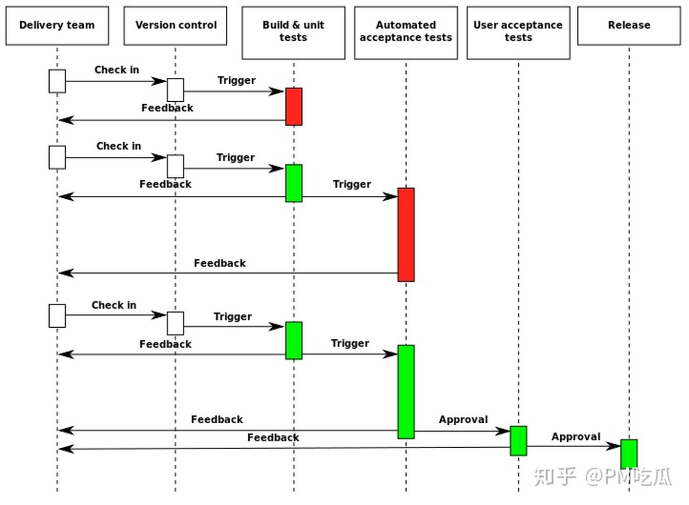

# 什么是CI/CD

## 前言

CI/CD 是实现敏捷和 Devops 理念的一种方法。

具体而言，CI/CD 可让持续自动化和持续监控贯穿于应用的整个生命周期（从集成和测试阶段，到交付和部署）。这些关联的事务通常被统称为“CI/CD 管道”，由开发和运维团队以敏捷方式协同支持。

## CI - 持续集成

定义： is the practice of merging all developers' working copies to a shared mainline
several times a day

持续集成指的是，频繁地（一天多次）将代码集成到主干。

CI 是一种通过在应用开发阶段引入自动化来频繁向客户交付应用的方法。CI 的核心概念是持续集成、持续交付和持续部署。作为一个面向开发和运营团队的解决方案，CI 主要针对在集成新代码时所引发的问题（亦称“集成地狱”）。

持续集成强调开发人员提交了新代码之后，立刻自动的进行构建、（单元）测试。根据测试结果，我们可以确定新代码和原有代码能否正确地集成在一起。

### 持续集成的目的

就是让产品可以快速迭代，同时还能保持高质量。它的核心措施是，代码集成到主干之前，必须通过自动化测试。只要有一个测试用例失败，就不能集成。

持续集成过程中很重视自动化测试验证结果，对可能出现的一些问题进行预警，以保障最终合并的代码没有问题。

### 持续集成的作用

- 代码库存越是积压，就越得不到生产检验，积压越多，代码间交叉感染的概率越大，下个发布（release）的复杂度和风险越高，持续集成可以保证团队开发人员提交代码的质量，减轻了软件发布时的压力；
- 持续集成中的任何一个环节都是自动完成的，无需太多的人工干预，有利于减少重复过程以节省时间、费用和工作量；
- 及早的发现代码中的问题，及早解决，代码越早推送（PUSH）出去，用户能越早用到，快就是商业价值；

### 特点

- 它是一个自动化的周期性的集成测试过程，从检出代码、编译构建、运行测试、结果记录、测试统计等都是自动完成的，无需人工干预；（脚本）
- 需要有专门的集成服务器来执行集成构建；（集成服务器）
- 需要有代码托管工具支持；（GitHub、gitlab、coding 等等）

## CD // 持续交付

定义：is a software engineering approach in which teams produce software in short cycles,
ensuring that the software can be reliably released at any time and, when releasing
the software, doing so manually.

### 目的

It aims at building, testing, and releasing software with greater speed and frequency

### CD 与 DevOps 关系

持續交付與 DevOps 的含義很相似，所以經常被混淆。但是它們是不同的兩個概念。

DevOps 的範圍更廣，它以文化變遷為中心，特別是軟件交付過程所涉及的多個團隊之間的合作（開發、運維、QA、管理部門等），並且將軟件交付的過程自動化。另一方面，持續交付是一種自動化交付的手段，關注點在於將不同的過程集中起來，並且更快、更頻繁地執行這些過程。
