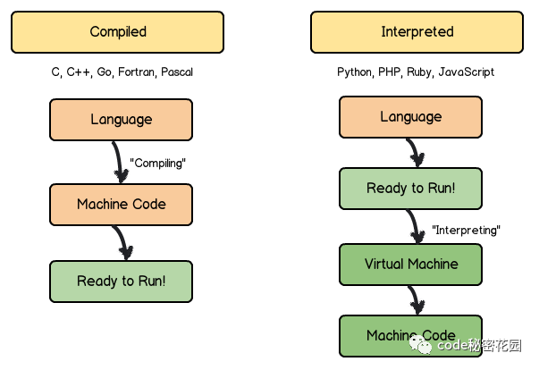
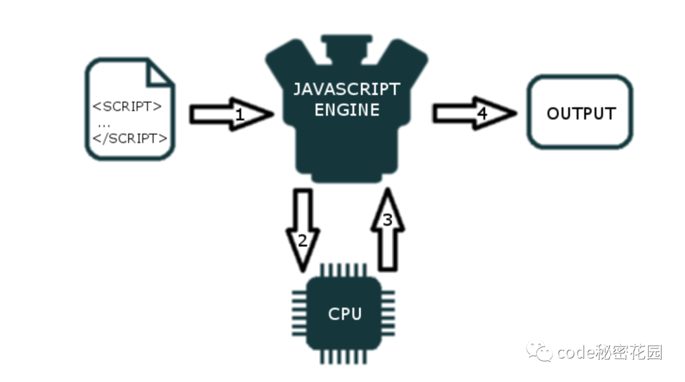
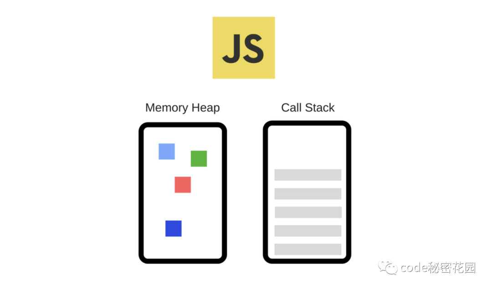
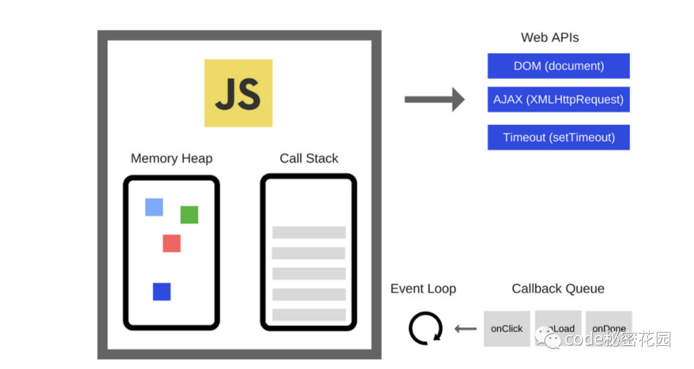
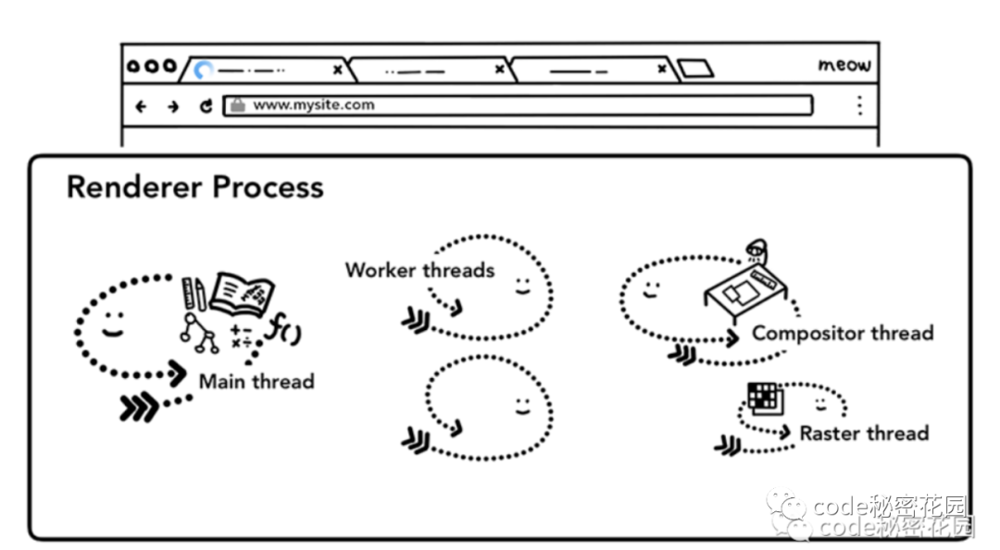
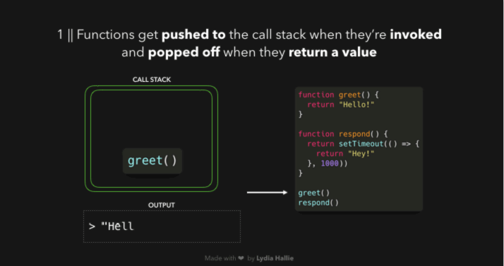
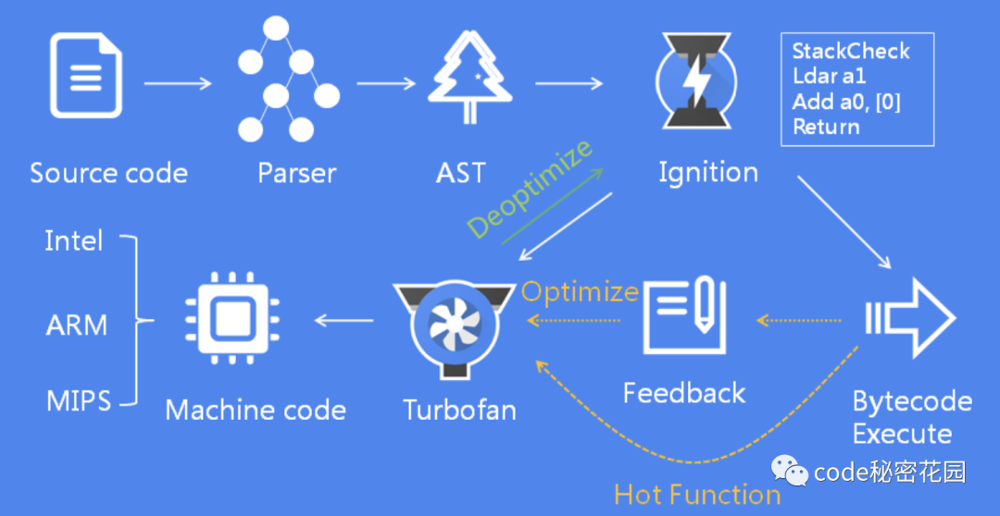
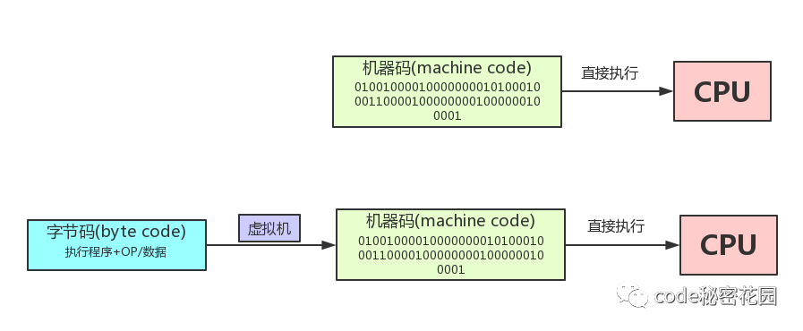

# JavaScript 的运行原理

回顾一下，JavaScript 的真正的工作原理，里面不涉及深入的源码解析，只是希望能够用最简单的描述让大家弄明白整个过程，主要分为下面几个部分：

## 一、解释型和编译型语言

大家可能之前都听说过，JavaScript 是一种解释型的编程语言，那么啥叫解释型语言呢？

编程语言是用来写代码的，代码是给人看的。计算机只看得懂机器代码（01010101），看不懂语言代码。将我们能看得懂的代码转换为计算机可读的机器代码有两种方式：解释和编译。



### 1. 编译型语言

编译型语言直接可以转换为计算机处理器可以执行的机器代码，运行编译型语言需要一个 “构建” 的步骤，每次更新了代码你也要重新 “构建” 。

它们会比解释语言更快更高效地执行。也可以更好的控制硬件，例如内存管理和 CPU 使用率。但是，在完成整个编译的步骤需要花费额外的时间，生成的二进制代码对平台有一定的依赖性。

常见的编译型语言有 C、C ++、Erlang、Haskell、Rust 和 Go。

### 2. 解释型语言

解释型语言 是通过一个解释器逐行解释并执行程序的每个命令。

因为在运行时翻译代码的过程增加了开销，解释型语言曾经比编译型语言慢很多。但是，随着即时编译的发展，这种差距正在缩小。

但是，解释型语言更灵活一点，并且一般都能动态植入，程序也比较小。另外，因为是通过解释器自己执行源程序代码的，所以代码本身相对于平台是独立的。

常见的解释型语言有 PHP、Ruby、Python 和 JavaScript。

### 3. 最后再来看看，谁来编译？谁来解释？谁来执行？

- 编译型：编译器来编译，系统执行。
- 解释型：解释器解释并执行。

## 二、JavaScript 引擎

JavaScript 是一种解释型的编程语言，所以源代码在执行之前没有被编译成二进制代码。那么计算机是怎么理解和执行纯文本脚本的呢？

这就是 JavaScript 引擎的工作，也就是我们上面提到的解释器。

JavaScript 引擎是一个执行 JavaScript 代码的计算机程序。基本上所有现代浏览器都内置了 JavaScript 引擎。当我们的浏览器中加载到 JavaScript 文件时，JavaScript 引擎会从上到下解析（将其转换为机器码）并执行文件的每一行。



每个浏览器都有自己的 JavaScript 引擎，其中最著名的引擎是 Google 的 V8。

Google Chrome 和 Node.js 的 JavaScript 引擎都是 V8。下面还有一些其他的常见引擎：

1. SpiderMonkey：由 Firefox 开发，第一款 JavaScript 引擎，用于 Firefox。
2. Chakra：由微软开发，用于 Microsoft Edge。
3. JavaScriptCore：由苹果开发，用于 webkit 型浏览器，比如 Safari。

所有的 JavaScript 引擎都会包含一个调用栈和一个堆：



- 内存堆 - 这是内存分配发生的地方，是一个非结构化的内存池，它存储我们应用程序需要的所有对象。
- 调用堆栈 - 是我们的代码实际执行的地方。

## 三、EcmaScript 和 JavaScript 引擎的关系

### 1. ECMAScript

ECMAScript 指的是 JavaScript 的语言标准及语言版本，比如 ES6 表示语言（标准）的第 6 版。它由一个推动 JavaScript 发展的委员会制定，这个委员会指的是技术委员会（ Technical Committee ）第 39 号，我们一般简称 TC39，由各个主流浏览器厂商的代表以及一些互联网大厂构成。

### 2. JavaScript 引擎

JavaScript 引擎的核心就是实现 ECMAScript 标准，此外还提供一些额外的机制（例如 V8 提供的垃圾回收器）。

一些最新的 ECMAScript 提案，到达 stage3 或 stage4 后，就会被 JavaScript 引擎实现，例如 v8 会把它的一些对语言标准的实现更新在它的博客上：https://v8.dev/

## 四、运行时环境

JavaScript 引擎并不能孤立运行，它需要一个好的运行时环境才能发挥更大的作用，例如 Node.js 就是一个 JavaScript 运行时环境，各种浏览器也是 JavaScript 的运行时环境。

这些运行时环境往往会提供诸如：事件处理、网络请求 API、回调队列或消息队列、事件循环 这样的附加能力。



那么 JavaScript 引擎怎么配合这些能力在运行时环境中发挥作用呢？我们拿 Chrome 来举个例子。

### Chrome 示例



Chrome 是一个多进程的架构，我们打开一个浏览器时会启动多个不同的进程协助浏览器将页面为我们呈现出来：

#### 1. 浏览器进程：

浏览器最核心的进程，负责管理各个标签页的创建和销毁、页面显示和功能（前进，后退，收藏等）、网络资源的管理，下载等。

#### 2. 插件进程：

负责每个第三方插件的使用，每个第三方插件使用时候都会创建一个对应的进程、这可以避免第三方插件 crash 影响整个浏览器、也方便使用沙盒模型隔离插件进程，提高浏览器稳定性。

#### 3. GPU 进程：

负责 3D 绘制和硬件加速

#### 4. 渲染进程：

浏览器会为每个窗口分配一个渲染进程、也就是我们常说的浏览器内核，这可以避免单个 page crash 影响整个浏览器。

### 浏览器内核

我们常说的浏览器内核，比如 webkit 内核，就是浏览器的渲染进程，从接收下载文件后再到呈现整个页面的过程，由浏览器渲染进程负责。浏览器内核是多线程的，在内核控制下各线程相互配合以保持同步，一个浏览器内核通常由以下常驻线程组成：

#### 1. GUI 渲染线程：

负责渲染浏览器界面 HTML 元素,当界面需要重绘(Repaint)或由于某种操作引发回流(reflow)时,该线程就会执行。

#### 2. 定时触发器线程：

浏览器定时计数器并不是由 JavaScript 引擎计数的, 因为 JavaScript 引擎是单线程的, 如果处于阻塞线程状态就会影响记计时的准确, 因此通过单独线程来计时并触发定时是更为合理的方案。

#### 3. 事件触发线程：

当一个事件被触发时该线程会把事件添加到待处理队列的队尾，等待 JS 引擎的处理。这些事件可以是当前执行的代码块如定时任务、也可来自浏览器内核的其他线程如鼠标点击、AJAX 异步请求等，但由于 JS 的单线程关系所有这些事件都得排队等待 JS 引擎处理。

#### 4. 异步 http 请求线程：

XMLHttpRequest 在连接后是通过浏览器新开一个线程请求， 将检测到状态变更时，如果设置有回调函数，异步线程就产生状态变更事件放到 JavaScript 引擎的处理队列中等待处理。

#### 5. JavaScript 引擎线程：

解释和执行 JavaScript 代码。

GUI 渲染线程与 JavaScript 引擎为互斥的关系，当 JavaScript 引擎执行时 GUI 线程会被挂起， GUI 更新会被保存在一个队列中等到引擎线程空闲时立即被执行。

JavaScript 是一种单线程编程语言，所以在浏览器内核中只有一个 JavaScript 引擎线程。

但是，在 JavaScript 的一个运行环境中，因为可能有多个渲染进程，所以可能有多个 JavaScript 引擎线程。

详情可以见这篇文章：[浏览器是如何调度进程和线程的？](https://mp.weixin.qq.com/s?__biz=MzAxODE2MjM1MA==&mid=2651562935&idx=2&sn=951311d793a7c61702a5b04848d2d6ab&chksm=80257476b752fd604d58f584b00432faba2bf43751cc7931ba8bc48b33a884125c52f12020d7&scene=21#wechat_redirect)

## 五、为啥是单线程

### 问题 1：为什么 JavaScript 不设计成多个线程呢？这样不是效率更高？

作为浏览器脚本语言， JavaScript 的主要用途是与用户互动，以及操作 DOM。这决定了它只能是单线程，否则会带来很复杂的同步问题。

比如，假定 JavaScript 同时有两个线程，一个线程在某个 DOM 节点上添加内容，另一个线程删除了这个节点，这时浏览器应该以哪个线程为准？

所以，为了避免复杂性，从一诞生， JavaScript 就是单线程，这已经成了这门语言的核心特征，将来也不会改变。

### 问题 2：那么既然 JavaScript 本身被设计为单线程，为何还会有像 WebWorker 这样的多线程 API 呢？

我们来看一下 WebWorker 的核心特点就明白了：

1. 创建 Worker 时， JS 引擎向浏览器申请开一个子线程（子线程是浏览器开的，完全受主线程控制，而且不能操作 DOM）
2. JS 引擎线程与 Worker 线程间通过特定的方式通信（postMessage API，需要通过序列化对象来与线程交互特定的数据）

所以 WebWorker 并不违背 JS 引擎是单线程的 这一初衷，其主要用途是用来减轻 cpu 密集型计算类逻辑的负担。

### 好处：

在单线程上运行代码非常容易，你不必处理多线程环境中出现的复杂场景 — 例如死锁。

## 六、调用堆栈的执行过程

JavaScript 是一种单线程编程语言，这意味着它只有一个调用堆栈，一次只能做一件事。

调用堆栈是一种数据结构，它基本上记录了我们在程序中的位置。如果我们执行一个函数，它放会放在栈顶。如果我们从一个函数返回，其会从栈顶弹出，这就是调用堆栈的执行过程。下面这个动图很好的解释了整个运行过程：



调用堆栈中的每个条目被称为 **堆栈帧**。当调用堆栈中的一个 堆栈帧 需要大量时间才能被处理时，就会产生卡顿，因为浏览器没法做其他事情了。

## 七、JavaScript 语言的解析执行过程

### （一）解析执行过程

我们从宏观上看到了 JavaScript 调用堆栈是怎么执行的，那么具体到每段代码上是怎么解析执行的呢？

下面我们就以 V8 为例，来看看一段 JavaScript 代码的解析执行过程。



上面的图展示了 V8 大体的工作流程，画的很复杂，我们简化一下，其实核心模块是下面三个：

#### 1. 解析器（Parser）：负责将 JavaScript 代码转换成 AST 抽象语法树。

#### 2. 解释器（Ignition）：负责将 AST 转换为字节码，并收集编译器需要的优化编译信息。

#### 3. 编译器（TurboFan）：利用解释器收集到的信息，将字节码转换为优化的机器码。

在执行 JavaScript 代码时，首先解析器会将源码解析为 AST 抽象语法树，解释器会将 AST 转换为字节码，一边解释一边执行。然后编译器根据解释器的反馈信息，优化并编译字节码，最后生成优化的机器码，这就是 V8 大体的工作流程。

### （二）词法分析和语法分析

我们常常提到的词法分析和语法分析的过程就是发生在解析器（Parser）执行阶段。

#### 1. 词法分析就是将字符序列转换为标记（token）序列的过程。

所谓 token ，就是源文件中不可再进一步分割的一串字符，类似于英语中单词，或汉语中的词。

一般来说程序语言中的 token 有：

1. 常数（整数、小数、字符、字符串等），
2. 操作符（算术操作符、比较操作符、逻辑操作符），
3. 分隔符（逗号、分号、括号等），
4. 保留字，
5. 标识符（变量名、函数名、类名等）等。

比如下面这段代码：

```
const 公众号 = '微信公号名称';
```

经过词法分析后，会被转换为下面这些 token：

- const（保留字）
- 公众号（变量名）
- =（赋值操操作算符）
- '微信公号名称'（字符串常数）

#### 2. 语法分析 将这些 token 根据语法规则转换为 AST：

```
{
  "type": "Program",
  "start": 0,
  "end": 23,
  "body": [
    {
      "type": "VariableDeclaration",
      "start": 0,
      "end": 23,
      "declarations": [
        {
          "type": "VariableDeclarator",
          "start": 6,
          "end": 22,
          "id": {
            "type": "Identifier",
            "start": 6,
            "end": 9,
            "name": "公众号"
          },
          "init": {
            "type": "Literal",
            "start": 12,
            "end": 22,
            "value": "微信公号名称",
            "raw": "'微信公号名称'"
          }
        }
      ],
      "kind": "const"
    }
  ],
  "sourceType": "module"
}
```

在生成 AST 的同时，还会为代码生成执行上下文，在解析期间，所有函数体中声明的变量和函数参数，都被放进作用域中，如果是普通变量，那么默认值是 undefined，如果是函数声明，那么将指向实际的函数对象。

### （三）字节码和机器码

有了 AST 和执行上下文，解释器会将 AST 转换为字节码并执行，那么字节码和机器码的区别是啥呢？



#### 字节码和机器码原理：

- 机器码(machine code)，学名机器语言指令，有时也被称为原生码（Native Code），是电脑的 CPU 可直接解读的数据(计算机只认识 0 和 1)。
- 字节码（byte code）是一种包含执行程序、由一序列 OP 代码(操作码)/数据对 组成的二进制文件。字节码是一种中间码，它比机器码更抽象，需要直译器转译后才能成为机器码的中间代码。

相比机器码，字节码不仅占用内存少，而且生成字节码的时间很快，提升了启动速度。那么机器码什么时候用到呢？我们在文章开头提到，随着即时编译的发展，解释型语言和编译型语言的运行速度的差距正在缩小。

同时采用了解释执行和编译执行这两种方式，这种混合使用的方式就称为 JIT (即时编译)，V8 采用的就是这种技术。

#### 即时编译原理：

在解释器执行字节码的过程中，如果发现有热点代码，比如一段代码被重复执行多次，这种就称为热点代码，那么后台的编译器就会把该段热点的字节码编译为高效的机器码，然后当再次执行这段被优化的代码时，只需要执行编译后的机器码就可以了，这样就大大提升了代码的执行效率。

## 八、最后

想要了解更详细的执行机制，可以看看 V8 源码，这篇文章主要带大家捋清楚各种概念，让你能够知道运行一段 JavaScript 背后的工作原理，想要更深入的了解，可以看看下面这些文章：。

[Js 是怎样运行起来的？](https://zhuanlan.zhihu.com/p/383959486)

[什么是解释型语言？](https://www.zhihu.com/question/268303059)
