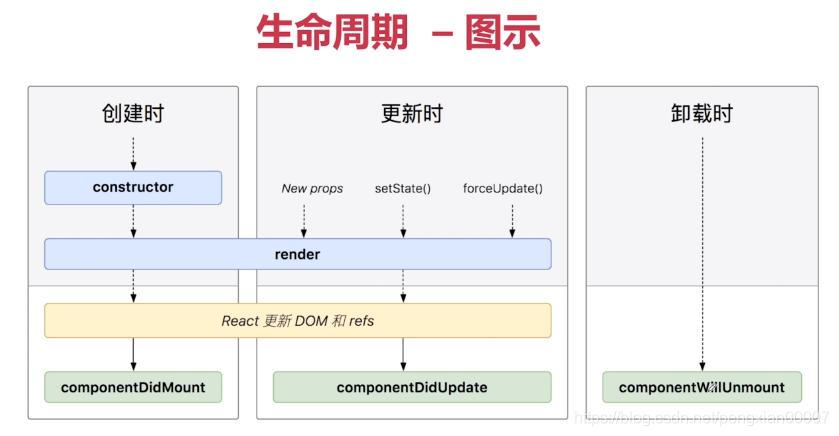
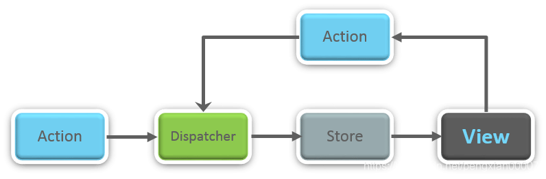
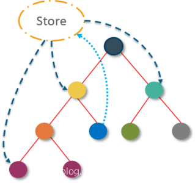
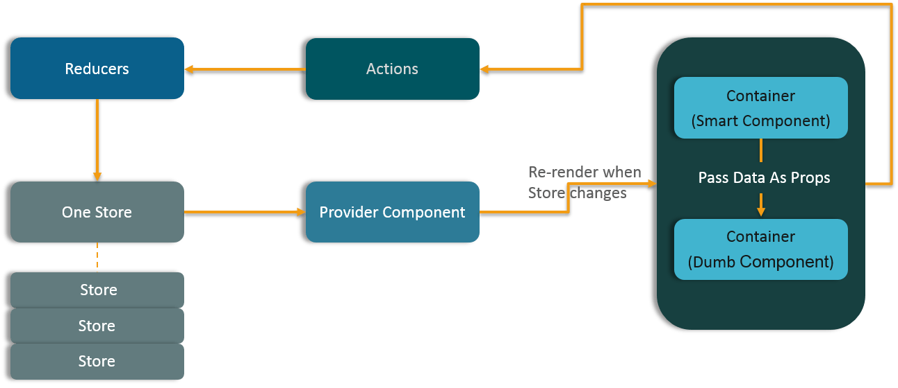

# 50 个 React 面试题及解析

## 一、常见面试题

### （一）真实 DOM 和虚拟 DOM 有什么区别？

| 真实 DOM                         | 虚拟 DOM                 |
| -------------------------------- | ------------------------ |
| 更新很慢                         | 更新较快                 |
| 可以直接更新 HTML                | 不能直接更新 HTML        |
| 如果元素更新，则创建一个新的 DOM | 如果元素更新，则更新 JSX |
| DOM 操作非常昂贵                 | DOM 操作非常简单         |
| 内存浪费太多                     | 无内存浪费               |

### （二）什么是 React？

1. React 是 Facebook 于 2011 年开发的前端 JavaScript 库。
2. 它遵循基于组件的方法，有助于构建可重用的 UI 组件。
3. 它用于开发复杂的交互式 Web 和移动 UI。
4. 尽管它仅在 2015 年才开源，但它是拥有最多支持的社区之一。

### （三）React 有哪些特征？

1. 它使用虚拟 DOM 而不是真实的 DOM
2. 它可以使用服务器端渲染
3. 它遵循单向数据流或数据绑定。

### （四）列出 React 的一些主要优点？

1. 它提高了应用程序的性能
2. 它可以方便地用于客户端和服务器端
3. 由于使用 JSX，使得代码的可读性增加
4. React 很容易与 Meteor、Angular 等其他框架集成
5. 使用 React，编写 UI 测试用例变得极其简单

### （五）React 的局限性是什么？

1. React 只是一个库，而不是一个成熟的框架
2. 它的代码非常多，并且复杂，所以需要时间来理解
3. 新手程序员理解起来可能有点困难
4. 编码变得复杂，因为它使用内联模板和 JSX

### （六）什么是 JSX？

JSX 是 JavaScript XML 的简写。这是 React 使用的一种文件类型，它利用了 JavaScript 的表现力以及类似 HTML 的模板语法。使得 HTML 文件非常容易理解。此文件使应用程序变得更强大并提高其性能。

### （七）你对虚拟 DOM 的理解是什么？解释它的工作原理？

虚拟 DOM 是一个轻量级的 JavaScript 对象，最初只是真实 DOM 的副本。一个节点树，将元素、它们的属性和内容列为对象及其属性。React 的 render 函数从 React 组件中创建一个节点树。然后它更新这棵树以响应数据模型中由用户或系统执行的各种操作引起的变化。

虚拟 DOM 分三个简单的步骤：

1. 每当任何底层数据发生变化时，整个 UI 都会在虚拟 DOM 表示中重新呈现。

   

2. 然后计算之前的 DOM 和新的 DOM 之间的差异。

   

3. 计算完成后，真正的 DOM 将只更新实际更改的内容。

   

### （八）为什么浏览器不能读取 JSX？

浏览器只能读取 HTML CSS JavaScript 对象，但不能读取常规 JavaScript 对象中的 JSX。因此，为了让浏览器能够读取 JSX，首先，我们需要使用 Babel 等 JSX 转换器将 JSX 文件转换为 JavaScript 对象，然后将其传递给浏览器。

### （九）与 ES5 相比，React 的 ES6 语法有何不同？

从 ES5 到 ES6 的语法有以下几个方面的变化：

1. require vs import

```
// ES5
var React = require('react');
// ES6
import React from 'react';
```

2. export vs exports

```
// ES5
module.exports = Component;
​
// ES6
export default Component;
```

3. component and function

```
// ES5
var MyComponent = React.createClass({
    render: function() {
        return (<h3>Hello Edureka!</h3>)
    }
})
​
// ES6
class MyComponent extends React.Component {
    render() {
        return (<h3>Hello Edureka!</h3>)
    }
}
```

4. props

```
// ES5
var App = React.createClass({
    propTypes: { name: React.PropTypes.string },
    render: function() {
        return <h3>Hello, {this.props.name}!</h3>
    }
});
​
// ES6
class App extends React.Component {
    render() {
        return <h3>Hello, {this.props.name}!</h3>
    }
}
```

5. state

```
// ES5
var App = React.createClass({
    getInitialState: function() {
        return { name: 'world' }
    },
    render: function() {
        return <h3>Hello, {this.state.name}!</h3>
    }
});
​
// ES6
class App extends React.Component {
    constructor() {
        super();
        this.state = { name: 'world' };
    }
    render() {
        return <h3>Hello, {this.state.name}!</h3>
    }
}
```

### （十）React 与 Angular 有何不同？

- **架构**：React 只有 MVC 的视图，Angular 是完整的 MVC
- **渲染**：React 服务端渲染，Angular 客户端渲染
- **DOM**：React 使用虚拟 DOM，Angular 使用真正的 DOM
- **数据绑定**：React 单向数据绑定，Angular 双向数据绑定
- **作者**：React 是 Facebook，Angular 是谷歌

### （十一）React 与 Vue 的区别？

## 二、React 组件面试题

### （十二）如何理解“在 React 中，一切都是组件”？

组件是 React 应用程序 UI 的构建块。这些组件将整个 UI 拆分为独立且可重用的小块。然后它呈现这些组件中的每一个，而不会影响 UI 的其余部分。

### （十三）React 中 render() 函数的目的是什么？

每个 React 组件都必须有一个 render()。它返回一个 React 元素，它是原生 DOM 组件的表示方式。如果需要渲染多个 HTML 元素，则必须将它们组合在一个封闭标签中，此函数必须保持纯洁，即每次调用时必须返回相同的结果。

### （十四）如何将两个或多个组件嵌入到一个中？

```
class MyComponent extends React.Component{
    render() {
        return (
            <div>
                <h1>Hello</h1>
                <Header/>
            </div>
            );
    }
}

class Header extends React.Component{
    render() {
        return (<h1>Header Component</h1>)
    };
}

ReactDOM.render(<MyComponent />, document.getElementById('content'));
```

### （十五）什么是 Props？

Props 是 React 中 Properties 的简写。它们是只读组件，必须保持纯净，即不可变。在整个应用程序中，它们总是从父组件传递给子组件。子组件永远不能将 prop 发送回父组件。这有助于维护单向数据流，通常用于呈现动态生成的数据。

### （十六）React 中的 state 是什么，它是如何使用的？

state 状态是 React 组件的核心。状态是数据的来源，必须尽可能简单。基本上，状态是决定组件渲染和行为的对象。与 props 不同，它们是可变的，并创建动态和交互式组件。它们通过 this.state() 访问。

- 动态地：在这种情况下，变量可以容纳多种类型；就像在 JS 中，变量可以采用数字，字符。
- 静态地：在这种情况下，变量只能容纳一种类型，就像在 Java 中声明为 string 的变量只能接受一组字符，而不能执行其他任何操作。

### （十七）对比 state 和 props 的区别？

| 条件                 | state | props |
| -------------------- | ----- | ----- |
| 从父组件接收初始值   | 是的  | 是的  |
| 父组件可以改变值     | 不是  | 是的  |
| 在组件内部设置默认值 | 是的  | 是的  |
| 组件内部变化         | 是的  | 不是  |
| 为子组件设置初始值   | 是的  | 是的  |
| 子组件内部的变化     | 不是  | 是的  |

### （十八）如何更新组件状态？

可以使用 this.setState() 更新组件的状态：

```
class MyComponent extends React.Component {
    constructor() {
        super();
        this.state = {
            name: 'Maxx',
            id: '101'
        }
    }
    render() {
            setTimeout(()=>{this.setState({name:'Jaeha', id:'222'})},2000)
            return (
                <div>
                    <h1>Hello {this.state.name}</h1>
                    <h2>Your Id is {this.state.id}</h2>
                </div>
            );
        }
    }
}

ReactDOM.render(<MyComponent/>, document.getElementById('content'));
```

### （十九）React 中的箭头函数是什么？它是如何使用的？

箭头函数更多是用于编写函数表达式的简短语法。它们也被称为“胖箭头”（=>）函数。这些函数允许正确绑定组件的上下文，因为在 ES6 中自动绑定默认不可用。箭头函数在处理高阶函数时最有用。

```
//General way
render() {
    return(
        <MyInput onChange={this.handleChange.bind(this) } />
    );
}

//With Arrow Function
render() {
    return(
        <MyInput onChange={ (e) => this.handleOnChange(e) } />
    );
}
```

### （二十）如何区分状态和非状态组件？

1. 有状态
   - 在内存中存储有关组件状态变化的信息
   - 有权改变状态
   - 包含过去、现在和未来可能的状态变化
   - 无状态组件通知它们状态变化的要求，然后它们将 props 发送给无状态组件。
2. 无状态
   - 计算组件的内部状态
   - 无权改变状态
   - 不包含过去、现在和可能的未来状态变化
   - 它们从有状态组件接收 props 并将其视为回调函数。

| 有状态                                                                | 无状态                                          |
| --------------------------------------------------------------------- | ----------------------------------------------- |
| 在内存中存储有关组件状态变化的信息                                    | 计算组件的内部状态                              |
| 有权改变状态                                                          | 无权改变状态                                    |
| 包含过去、现在和未来可能的状态变化                                    | 不包含过去、现在和可能的未来状态变化            |
| 无状态组件通知它们状态变化的要求，然后它们将 props 发送给无状态组件。 | 它们从有状态组件接收 props 并将其视为回调函数。 |

### （二十一）React 组件生命周期的不同阶段是什么？



React 组件的生命周期分为三个不同的阶段：

1. 初始渲染阶段：这是组件即将开始其生命旅程并进入 DOM 的阶段。
2. 更新阶段：一旦组件被添加到 DOM，它可能只有在 props 或 state 发生变化时才可能更新和重新渲染。
3. 卸载阶段：这是组件生命周期的最后阶段，在该阶段中组件被销毁并从 DOM 中移除。

### （二十二）解释 React 组件的生命周期方法

1. **componentWillMount()** – 在客户端和服务器端渲染之前执行，16.8 后不使用。
2. componentDidMount() – 仅在第一次渲染后在客户端执行。
3. **componentWillReceiveProps()** – 一旦从父类接收到 props 并且在调用另一个渲染之前调用，16.8 后不使用。
4. shouldComponentUpdate() – 根据特定条件返回 true 或 false 值。如果你希望组件更新，请返回 true 否则返回 false。默认情况下，它返回 false。
5. **componentWillUpdate()** – 在 DOM 中进行渲染之前调用，16.8 后不使用。
6. componentDidUpdate() – 在渲染发生后立即调用。
7. componentWillUnmount () – 在组件从 DOM 中卸载后调用。它用于清理内存空间。

**Fiber 废除了三个，加多两个**

8. static getDerivedStateFromProps(nextProps, prevState) {} 替换 `componentWillReceiveProps` ，初始化和 update 时被调用，静态函数，无法使用 this。
9. getSnapshotBeforeUpdate() {}，获取更新前的状态快照，替换 componentWillUpdate。

### （二十三）React 中的事件是什么？

在 React 中，事件是对鼠标悬停、鼠标单击、按键等特定操作的触发反应。处理这些事件类似于处理 DOM 元素中的事件。但是有一些语法差异，例如：

1. 事件使用驼峰命名，而不是仅使用小写。`onClick`
2. 事件作为函数而不是字符串传递。`onChange={() => this.change()}`
3. event 参数包含一组特定于事件的属性。每个事件类型都包含自己的属性和行为，只能通过其事件处理程序访问。`可以拓展`

### （二十四）如何在 React 中创建事件？

```
class Display extends React.Component{
    show(evt) {
        // code
    },
    render() {
        // Render the div with an onClick prop (value is a function)
        return (<div onClick={this.show}>Click Me!</div>);
    }
};
```

### （二十五）React 中的合成事件是什么？

合成事件是充当浏览器本地事件的跨浏览器包装器的对象。它们将不同浏览器的行为组合成一个 API。这样做是为了确保事件在不同浏览器中显示一致的属性。

主要是为了处理兼容性。

### （二十六）如何理解 React 中的 refs 的？

Refs 是 React 中 References 的简写。它是一个有助于存储对特定 React 元素或组件的引用的属性，该引用将由组件渲染配置函数返回。它用于返回对 render() 返回的特定元素或组件的引用。当我们需要 DOM 测量或向组件添加方法时，它们会派上用场。

```
class ReferenceDemo extends React.Component{
    display() {
        const name = this.inputDemo.value;
        document.getElementById('disp').innerHTML = name;
    }
    render() {
        return(
            <div>
                Name: <input type="text" ref={input => this.inputDemo = input} />
                <button name="Click" onClick={this.display}>Click</button>
                <h2>Hello <span id="disp"></span> !!!</h2>
            </div>
        );
    }
}
```

### （二十七）列出一些应该使用 Refs 的情况

需要 dom 以及 dom 操作的时候

1. 当你需要管理 focus，选择文本或媒体播放
2. 触发命令式动画
3. 与第三方 DOM 库集成

### （二十八）如何在 React 中模块化代码？

我们可以通过使用导出和导入属性来模块化代码。它们有助于在不同的文件中分别编写组件。

```
// ChildComponent.jsx

export default class ChildComponent extends React.Component {
    render() {
        return(
            <div>
                <h1>This is a child component</h1>
            </div>
        )
    }
}

// ParentComponent.jsx

import ChildComponent from './childcomponent.js';
class ParentComponent extends React.Component {
    render() {
        return(
            <div>
                <ChildComponent />
            </div>
        )
    }
}
```

### （二十九）React 中的表单是如何创建的？

React 表单类似于 HTML 表单。但是在 React 中，状态包含在组件的 state 属性中，并且只能通过 setState() 更新。因此元素不能直接更新它们的状态，它们的提交是由 JavaScript 函数处理的。此功能可以完全访问用户在表单中输入的数据。

注：React 使用函数式编程，需要通过单向数据流更新表单状态，更新值 value。

```
handleSubmit(event) {
    alert('A name was submitted: ' + this.state.value);
    event.preventDefault();
}
​
render() {
    return (
        <form onSubmit={this.handleSubmit}>
            <label>
                Name:
                <input type="text" value={this.state.value} onChange={this.handleSubmit} />
            </label>
            <input type="submit" value="Submit" />
        </form>
    )
}
```

### （三十）如何理解受控和非受控组件？

| 受控组件                                        | 不受控制的组件            |
| ----------------------------------------------- | ------------------------- |
| 他们不维护自己的状态                            | 他们维护自己的状态        |
| 数据由父组件控制                                | 数据由 DOM 控制           |
| 它们通过 props 获取当前值，然后通过回调通知更改 | Refs 用于获取它们的当前值 |

注：

- 受控组件：通过触发事件更新父组件的值来更新自己的值
- 不受控组件：自己内部更新值

### （三十一）什么是高阶组件（HOC）？

高阶组件是重用组件逻辑的高级方法。基本上，它是一种源自 React 组合性质的模式。HOC 是自定义组件，其中包含另一个组件。它们可以接受任何动态提供的子组件，但不会修改或复制其输入组件的任何行为。您可以说 HOC 是“纯”组件。

### （三十二）高阶组件可以做些什么？

1. 代码重用、逻辑和引导程序抽象
2. 渲染高提升
3. 状态抽象和操作
4. props 操纵

### （三十三）什么是纯组件？

纯组件是可以编写的最简单和最快的组件。它们可以替换任何只有 render() 的组件。这些组件增强了代码的简单性和应用程序的性能。

### （三十四）keys 在 React 中的意义是什么？

键用于识别独特的虚拟 DOM 元素及其驱动 UI 的相应数据。它们通过回收 DOM 中的所有现有元素来帮助 React 优化渲染。这些键必须是唯一的数字或字符串，React 使用它只是重新排序元素而不是重新渲染它们。这会导致应用程序性能的提高。

## 三、React Redux 面试问题

### （三十五）MVC 框架的主要问题是什么？

1. DOM 操作非常昂贵
2. 应用程序缓慢且效率低下
3. 存在巨大的内存浪费
4. 由于循环依赖，围绕模型和视图创建了一个复杂的模型

### （三十六）解释一下通量 Flux？



Flux 是一种架构模式，它强制执行单向数据流。控制派生数据并使用对所有数据具有权限的中央存储实现多个组件之间的通信。整个应用程序中的任何数据更新都必须仅在此处进行。Flux 为应用程序提供稳定性并减少运行时错误。

### （三十七）什么是 Redux？

Redux 是市场上最流行的前端开发库之一。是 JavaScript 应用程序的可预测状态容器，用于整个应用程序状态管理。使用 Redux 开发的应用程序易于测试，并且可以在不同环境中运行，表现出一致的行为。

### （三十八）Redux 遵循的三个原则是什么？

1. 单一事实来源：整个应用程序的状态存储在单个存储中的对象/状态树中。单一状态树可以更轻松地跟踪随时间的变化以及调试或检查应用程序。
2. 状态是只读的： 改变状态的唯一方法是触发一个动作。操作是描述更改的普通 JS 对象。就像状态是数据的最小表示一样，动作是对该数据更改的最小表示。
3. 使用纯函数进行更改： 为了指定状态树如何通过操作转换，您需要纯函数。纯函数是那些返回值仅取决于其参数值的函数。

### （三十九）如何理解“单一事实来源”？

Redux 使用“Store”将应用程序的整个状态存储在一个地方。因此，所有组件的状态都存储在 Store 中，并且它们从 Store 本身接收更新。单一状态树可以更轻松地跟踪随时间的变化以及调试或检查应用程序。



### （四十）列出 Redux 组件

1. Action——它是一个描述发生了什么的对象。
2. Reducer——它是一个确定状态将如何改变的地方。
3. Store - 整个应用程序的状态/对象树保存在 Store 中。
4. View– 简单地显示 store 提供的数据。

### （四十一）演示数据如何在 Redux 中流动？



### （四十二）Redux 中 Actions 是如何定义的？

React 中的 Action 必须有一个 type 属性来指示正在执行的 ACTION 的类型。它们必须定义为 String 常量，您也可以向其添加更多属性。在 Redux 中，动作是使用名为 Action Creators 的函数创建的。以下是 Action 和 Action Creator 的示例：

```
function addTodo(text) {
    return {
        type: ADD_TODO,
        text
    }
}
```

### （四十三）解释 Reducer 的作用？

Reducers 是纯函数，它指定应用程序的状态如何响应 ACTION 变化。Reducers 通过接收之前的状态和动作来工作，然后它返回一个新状态。它根据操作的类型确定需要进行何种类型的更新，然后返回新值。 如果不需要做任何工作，它会按原样返回先前的状态。

### （四十四）Store 在 Redux 中的意义是什么？

store 是一个 JavaScript 对象，它可以保存应用程序的状态并提供一些辅助方法来访问状态、调度操作和注册侦听器。应用程序的整个状态/对象树保存在单个存储中。因此，Redux 非常简单且可预测。我们可以将中间件传递给 store 来处理数据的处理以及记录改变 store 状态的各种操作的日志。所有动作都通过减速器返回一个新状态。

### （四十五）Redux 与 Flux 有何不同？

| Redux                  | Flux(类似于 vuex 双向数据绑定) |
| ---------------------- | ------------------------------ |
| 存储和更改逻辑是分开的 | Store 包含状态和变更逻辑       |
| 只有一个 store         | 有多个 store                   |
| 没有调度员的概念       | 有单例调度器                   |
| 容器组件利用 connect   | React 组件订阅 store           |
| 状态是不可变的         | 状态是可变的                   |

### （四十六）Redux 有什么优势？

1. 结果的可预测性 —— 因为总是有一个真实的来源，即 store，关于如何将当前状态与应用程序的动作和其他部分同步，没有任何混淆。
2. 可维护性 —— 代码变得更容易维护，具有可预测的结果和严格的结构。
3. 服务器端渲染 —— 您只需要将在服务器上创建的 store 传递到客户端。这对于初始渲染非常有用，并提供更好的用户体验，因为它优化了应用程序性能。
4. 开发人员工具 —— 从操作到状态更改，开发人员可以实时跟踪应用程序中发生的一切。
5. 社区和生态系统 —— Redux 背后有一个庞大的社区，这使得它使用起来更加迷人。一个庞大的人才社区为图书馆的改进做出了贡献，并用它开发了各种应用程序。
6. 易于测试 ——Redux 的代码主要是小、纯和隔离的函数。这使得代码可测试且独立。
7. 组织——Redux 对代码的组织方式 非常精确，这使得当团队使用代码时代码更加一致和容易。

## 四、React Router 面试题

### （四十七）什么是 React-Router？

React-Router 是一个建立在 React 之上的强大路由库，它有助于向应用程序添加新的展示和流。这使 URL 与网页上显示的数据保持同步。它维护标准化的结构和行为，用于开发单页 Web 应用程序。React-Router 有一个简单的 API。

### （四十八）为什么在 React-Router v4 中使用 switch 关键字？

是用来封装 Router 内部的多条路由的。当您只想显示要在多个定义的路由中呈现的单个路由时，使用 “switch”关键字。使用中的标记将键入的 URL 与已定义的路由按顺序匹配。当找到第一个匹配项时，它会呈现指定的路由。从而绕过其余路线。

```
<switch>
    <route exact path=’/’ component={Home}/>
    <route path=’/posts/:id’ component={Newpost}/>
    <route path=’/posts’   component={Post}/>
</switch>
```

### （四十九）为什么我们在 React 中需要 Router？

路由器用于定义多个路由，当用户键入特定 URL 时，如果此 URL 与路由器内部定义的任何“路由”的路径匹配，则用户将被重定向到该特定路由。所以基本上，我们需要向应用程序添加一个 Router 库，它允许创建多个路由，每个路由都指向我们一个独特的视图。

### （五十）列出 React-Router 的优点？

1. 就像 React 基于组件的方式一样，在 React-Router v4 中，API 是’All About Components’。路由器可以被视为单个根组件，我们将特定的子路由包含在其中。
2. 无需手动设置 History 值：在 React-Router v4 中，我们需要做的就是将我们的路由包装在组件中。
3. 包是分开的：三个包分别用于 Web、Native 和 Core。这支持我们应用程序的紧凑尺寸。基于类似的编码风格很容易切换。

### （五十一）React-Router 和常规路由有什么区别？

| 话题               | 常规路由                                     | React-Router                           |
| ------------------ | -------------------------------------------- | -------------------------------------- |
| 涉及的页面         | 每个视图对应一个新文件                       | 只涉及单个 HTML 页面                   |
| 网址更改           | 向服务器发送 HTTP 请求并接收相应的 HTML 页面 | 仅更改了 History 属性                  |
| 用户感知           | 用户实际上为每个视图浏览不同的页面           | 用户被欺骗，认为他在不同的页面之间导航 |
| 组件内部变化       | 是的                                         | 不是                                   |
| 为子组件设置初始值 | 是的                                         | 是的                                   |
| 子组件内部的变化   | 不是                                         | 是的                                   |
