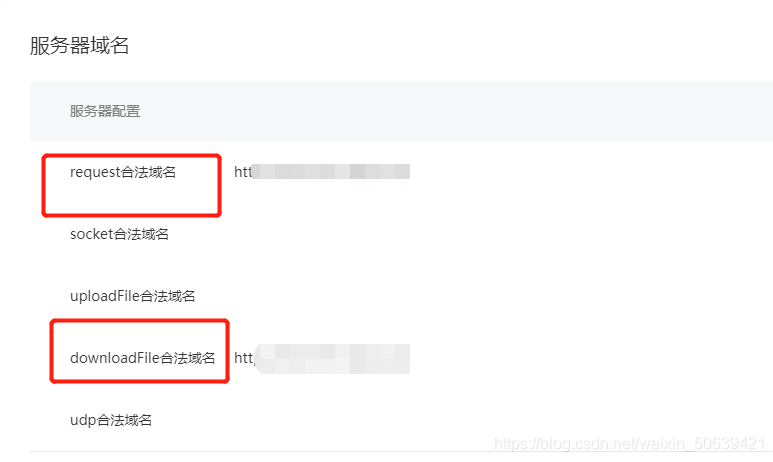

# 步骤
## 1、webview引入微信SDK（注：1.2.6版本以上）
## 2、使用 wx.miniProgram.navigateTo({ url: '' })方法（注：如果在webview中的iframe中使用，需要使用父页面调用方法：parents.wx.miniProgram.navigateTo，还未验证）
## 3、小程序开发下载文件以及预览文件方法
### （1）下载方法
```
wx.downloadFile({
  url: 'https://example.com/audio/123', //仅为示例，并非真实的资源
  success (res) {
    // 只要服务器有响应数据，就会把响应内容写入文件并进入 success 回调，业务需要自行判断是否下载到了想要的内容
    if (res.statusCode === 200) {
      wx.playVoice({
        filePath: res.tempFilePath
      })
    }
  }
})
```
### （2）打开文件
```
wx.saveFile({
    tempFilePath: filePath,
    success(res) {
        const savedFilePath = res.savedFilePath
    },
    fail(err){}
})
```
### （3）打开文件
```
wx.openDocument({
    filePath: savedFilePath,
    fileType: fileType,
    success: function (response) {
    },
    fail: function (res) {
    }
})
```

# 问题
## 1、下载文件之后保存在本地，需要预览打开
## 2、微信小程序使用wx.downloadFile和wx.saveFile在真机调试和体验版没问题,线上却下载失败
### 需要登录小程序【开发】-【开发管理】-【开发设置】-【服务器域名】去填写配置下载域名

    