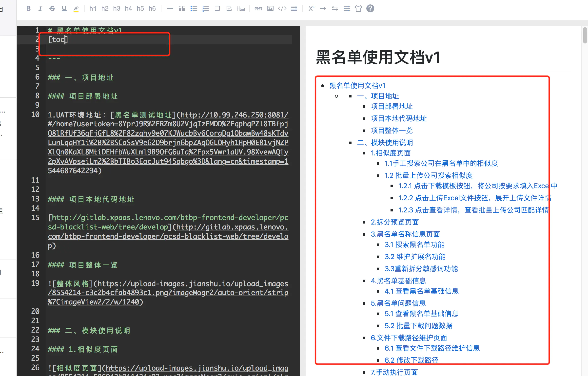
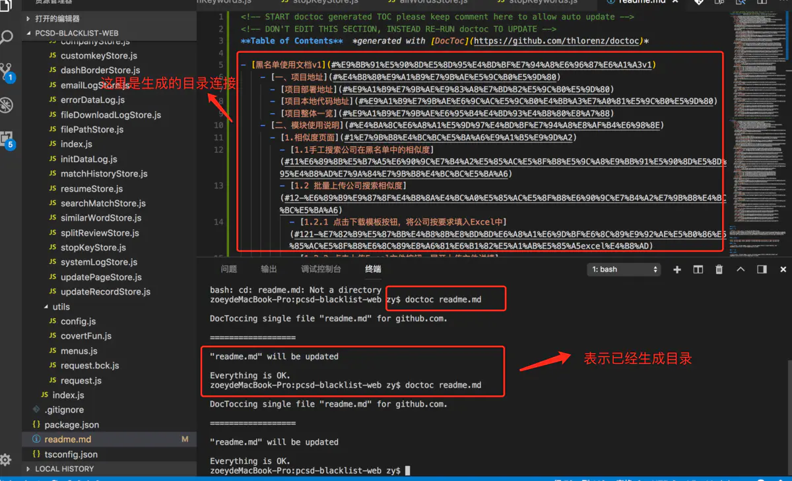

# markdown 文件生成目录的方式


## 前言

markdown 语法简单好上手，在项目中很多文档都是采用 markdown 语法完成的，以下介绍两种在 markdown 文档中自动生成目录的方式。

## 目录
<!-- START doctoc generated TOC please keep comment here to allow auto update -->
<!-- DON'T EDIT THIS SECTION, INSTEAD RE-RUN doctoc TO UPDATE -->
**Table of Contents**  *generated with [DocToc](https://github.com/thlorenz/doctoc)*

- [markdown 文件生成目录的方式](#markdown-文件生成目录的方式)
  - [前言](#前言)
  - [目录](#目录)
  - [一、有道自动生成](#一有道自动生成)
  - [二、npm 语法生成](#二npm-语法生成)
  - [三、两种方式的优缺点](#三两种方式的优缺点)

<!-- END doctoc generated TOC please keep comment here to allow auto update -->

## 一、有道自动生成

在文章开始地方输入[toc]，即可在对应位置插入目录

凡是文章标题带有#（1-6 个）的都会被捕获到目录中。



## 二、npm 语法生成

使用 npm（yarn 没有该包）全局安装 doctoc 插件

```
npm i doctoc -g //install 简写 i
```

假如你的 markdown 文件在 work/demo.md 文件下，只需要 cd work 切换到当前文件目录下，执行 doctoc demo.md 文件，即可在文档中自动生成目录。


## 三、两种方式的优缺点

1. 有道生成目录

- 优点是：简单快捷，

- 缺点是：直接生成文字目录，没有生成相应的目录连接

2. npm doctoc 生成目录

- 优点：生成了相应的目录连接（例如：文章段落一有地方要跳转到段落二，这时候有目录链接就很方便的完成跳转了）

- 缺点：依赖 npm
