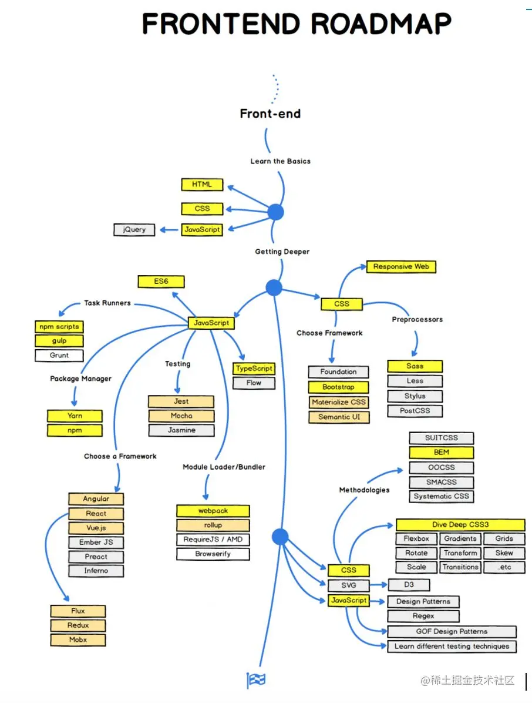
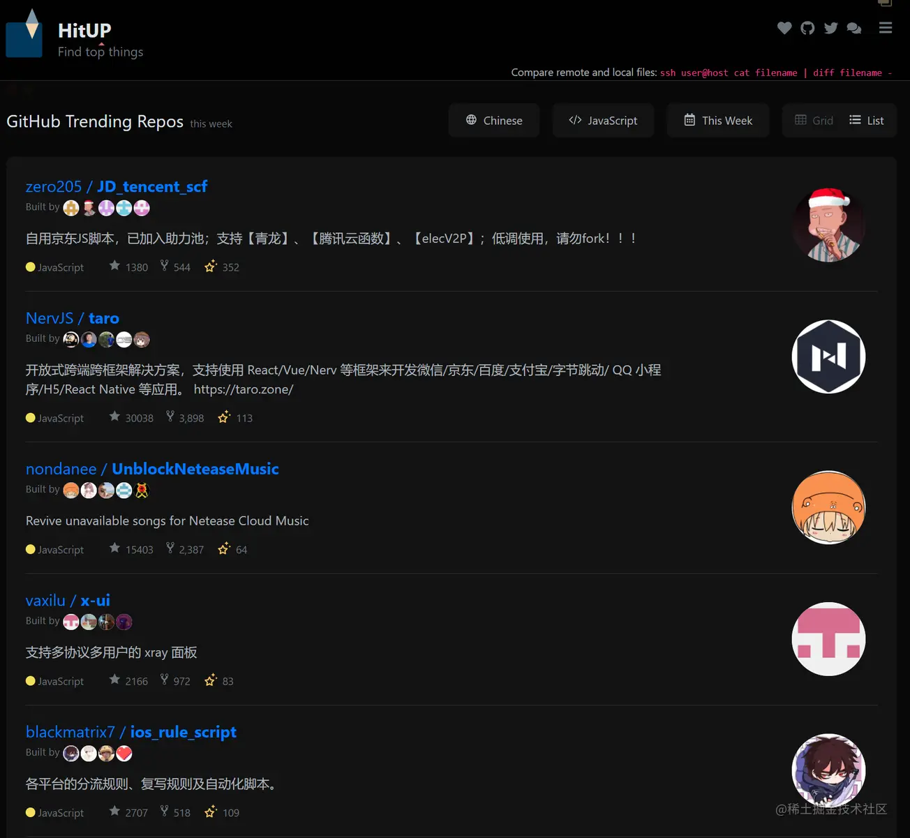
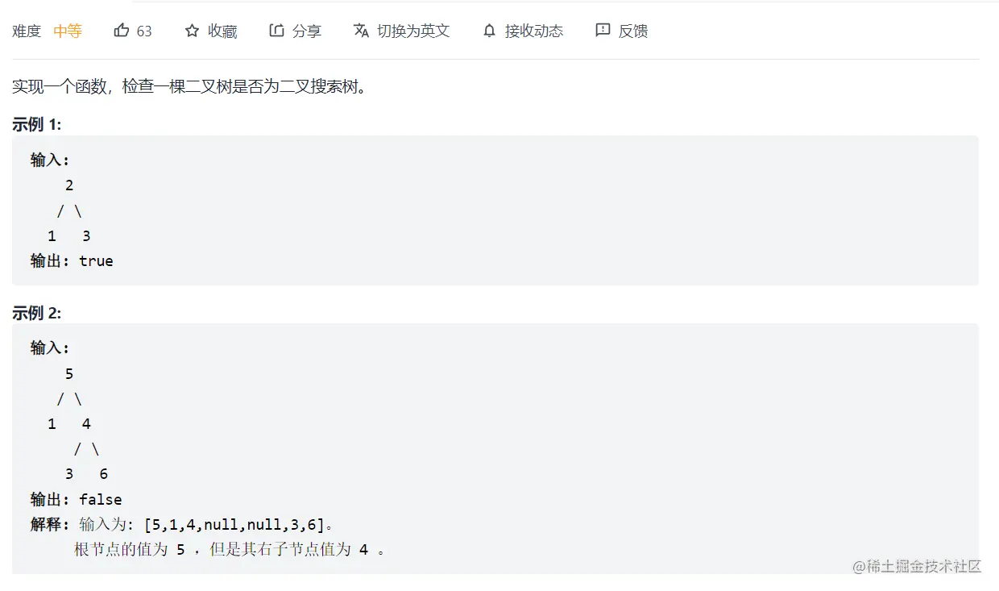
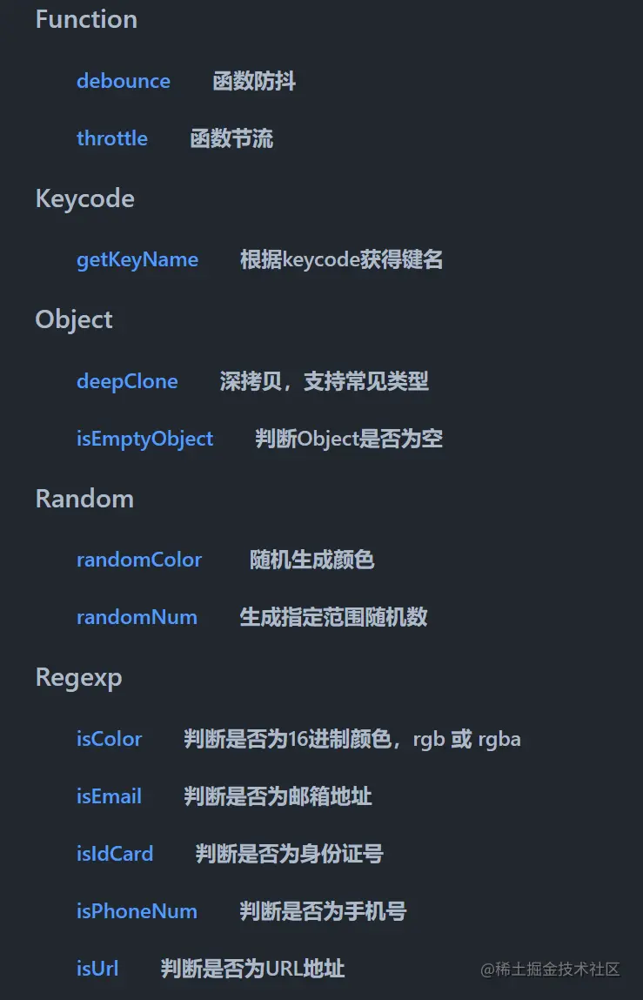
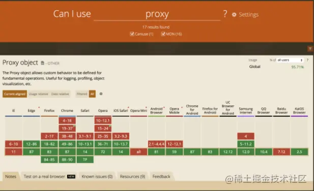

# 2022 年如何成为一名优秀的大前端 Leader

<!-- 文章来源：https://juejin.cn/post/7034419410706104356 -->

## 一、前言

有人调侃 Leader 的作用就是不让产品 🐕 骚扰到干活的攻城狮 🦁-😂 引用，没有招黑的意思。优秀的前端 Leader 要学会适当的拒绝，学会说 No。并不是做的越多越好，而是让团队做的少价值高才好。这背后其实是当下互联网技术发展到一定阶段，出现了专业壁垒的问题。需要更加了解业务，了解技术的专业人士来制定方案。

## 二、技术不能丢

作为一名前端 Leader，图谱基本都囊括了应该具备的技能，根据自己的业务线选择性的 一专多能 即可。



需要提的一点是 JavaScript（ES6+），必须精读，必须精通，这是你未来能够成就多高的基石。当你在纠结选择 Vue 或 React 的时候，说明你已经陷入了根基不稳的困境。对于优秀的前端来说，跨框架本就不应该有什么难度。只是了解不同的生命周期和开发规范罢了。

### （一）保持技术敏感度

毕竟是搞技术的，个人建议把更多的精力放在技术上，保持 Coding，保持学习和了解前沿技术。减少管理上形式化流程化的东西，减少不必要的会议等。但不能没有管理能力，否则团队输出会大打折扣。

建议每天早晚抽出 30 分钟，浏览一些论坛和前沿技术博客，比如 Hit Up，思掘知，少数派 等。时刻保持自己对技术的敏感度。



1. 前沿技术池:

- InfoQ 前端专栏：https://www.infoq.cn/topic/33
- 每日时报：https://wubaiqing.github.io/zaobao/
- indepth indepth-react：https://indepth.dev/search?query=react&tags=react

2. 大厂团队关注不可少：

- 阿里 UED：https://www.aliued.com/?cat=14
- 滴滴 FE BLOG：https://github.com/DDFE/DDFE-blog
<!-- - 头条前端 -->
- 有赞前端：https://tech.youzan.com/tag/front-end/page/2/
- 腾讯 AlloyTeam：http://www.alloyteam.com/page/0/
- 腾讯 TNFE：https://github.com/tnfe/TNT-Weekly
- 百度 EFE：https://efe.baidu.com/
- HYPERS 前端团队博客：https://blog.rsuitejs.com/
- InfoQ 前端专栏：https://www.infoq.cn/topic/33
- 印记中文周刊：https://docschina.org/
- 阮一峰老师 weekly：https://github.com/ruanyf/weekly
- 蚂蚁数据体验技术团队：https://github.com/ProtoTeam/blog
- TNFE-Weekly：https://github.com/tnfe/TNT-Weekly

有时候学习后端 Node 也是必不可少的，后端的语言有助于反哺前端技术能力。推荐拥有 9000 多万阅读量的，分享纯干货最直接的廖雪峰-Node.js：https://www.liaoxuefeng.com/wiki/1022910821149312/1023025235359040

### （二）保持技术深度

手写一些函数是基本功，最好达到熟练地步，可以通过练习来加强记忆。以下简单列举几个，网上也有很多资料。最好找个可以在线编程的，可以不借助工具快速搭题。

### （三）手写源码

1. 手写 instanceof

```
// 判断一个实例是否是其父类或者祖先类型的实例
let myInstanceof = (target, origin) => {
    while(target) {
        if (target.__proto__ === origin.prototype) {
            return true
        }
        target = target.__proto__
    }
    return false
}
let a = [1,2,3]
console.log(myInstanceof(a, Array)); // true
console.log(myInstanceof(a, Object)); // true
```

2. 手写深拷贝

```
let oldObj = {
    id: 1,
    name: 'SaoDiSeng',
    msg: {
        age: 18
    }
}

let newObj = {}
function deepCopy(newObj, oldObj) {
    for (var k in oldObj) {
        let item = oldObj[k]
        // 判断是否数组、对象、简单类型
        if (item instanceof Array) {
            newObj[k] = []
            deepCopy(newObj[k], item)
        } else if (item instanceof Object) {
            newObj[k] = {}
            deepCopy(newObj[k], item)
        } else {
            newObj[k] = item
        }
    }
}
```

3. 手写防抖

```
function debounce(fn, delay) {
    if (typeof fn !== 'function') {
        throw new TypeError('fn不是函数')
    }
    let timer; // 维护一个timer
    return function() {
        var _this = this; // 获取debounce执行作用域的this(原函数挂载到的对象)
        var args = arguments;
        if (timer) {
            clearTimeout(timer)
        }
        timer = setTimeout(() => {
            fn.apply(_this, args); // 用apply指向调用debounce的对象，相当于 _this.fn(args);
        }, delay);
    }
}

const fn2 = debounce(() => {
    console.log(input1.value)
}, 600)
input1.addEventListener('keyup', fn2)
```

### （四）刷刷算法题



```


```

## 三、善用工具

搞技术的应该为自己重复性的工作感到鄙视，技术是生产力。要学会通过工具的方式来减少重复性的工作，熟练利用工具可以让你效率翻倍提升，从而有助于提升愉悦的工作体验。

1. outils

其中推荐给大家我用着比较顺手的 outils,轻量级工具库，支持模块化加载。强烈建议读源码，以后搞项目就可以随手封装出一个类库。

工具地址：https://github.com/proYang/outils



2. CODEIF：变量命名神器（https://unbug.github.io/codelf/）
3. docschina：Web 前端优质的中文文档（https://docschina.org/）
4. RegExr：RegExr 是一个基于 HTML/JS 开发的在线工具，用来创建、测试和学习正则表达式。

特性：

- 输入时，结果会实时更新
- 支持 JavaScript 和 PHP/PCRE RegEx
- 将匹配项或表达式移至详细信息
- 保存并与他人共享表达式
- 在编辑器中使用 cmd-Z/Y 撤消和重做

5. Tool.lu：工具集合（https://tool.lu/）
6. CodeSandbox：在线的代码编辑器（https://codesandbox.io/）

CodeSandbox 是一个在线的代码编辑器，主要聚焦于创建 Web 应用项目。CodeSandbox

支持主流的前端相关文件的编辑：JavaScript、TypeScript、CSS、Less、Sass、Scss、HTML、PNG 等。

7. LightHouse：开源的自动化工具（https://github.com/GoogleChrome/lighthouse）

LightHouse 是一个开源的自动化工具，用于改进网络应用的质量。在里面你可以看到它给你各个方面的建议，比如图片、css、js 这些文件的处理，还有 html 里面标签的使用，缓存处理等建议，可以根据这些来对网站进行优化。 8. Can I Use

Can I Use 这个是一个针对前端开发人员定制的一个查询 CSS、Js 在个中流行浏览器钟的特性和兼容性的网站，可以很好的保证网页的浏览器兼容性。

有了这个工具可以快速的了解到代码在各个浏览器钟的效果。比如查询 transform 的浏览器支持情况：



8. Carbon：在线的代码转图片工具（https://carbon.now.sh/）

Carbon 是一个在线的代码转图片工具。发个朋友圈，发个脉脉，发个博客啥的贼能装 X 了。尤其咱们搞前端的，要注重用户体验的，所有输出的东西必须看得过去。

9. TinyPNG：（https://tinypng.com/）

TinyPNG PNG/JPG 图片在线压缩利器，智能 PNG 和 JPEG 图片压缩。

10. FrontEndGitHub：Github 最全前端导航（https://github.com/FrontEndGitHub/FrontEndGitHub）

FrontEndGitHub，收录了前端到全栈的最新最全的优质 github 文章和工具，有空就翻翻吧，翻阅慢了就过时了。


主要是借助工具提高效率的思维。

## 四、管理思维

成为一个合格的前端 LD，并不只是具备代码和架构的能力，而是要能够站在业务、用户的角度理解自己所做的产品，让技术成为业务价值的基石，并能够不断扩大自己的影响力，通过撬动更多的资源提升整个团队的效能。

1. 你能够为所从事的业务增加价值。
2. 你有能力抓住机会，而不会留有遗憾。
3. 人们喜欢你，和你一起工作后会保持积极的情绪。
4. 你可以不断学习和提高自己。

分享做管理者的几点感悟：

1. 松散的管理只会让团队越来越懒惰，并且随着时间推移，团队越来越多人会找不到价值点，从而流失。
2. 始终鼓励团队发展自己领域内擅长的事，感兴趣的事，愿意做的事。加以引导和资源倾斜，帮助其带来更高的成就和价值。

注：很多程序员都热爱技术，喜欢学习新东西，喜欢把新东西用到产品中，你要想各种办法给他机会，创造条件-这是你作为管理的责任。

3. 高要求换来高成长，即时奖励，劳逸结合，团队凝聚力强，执行有力，落地有声。
