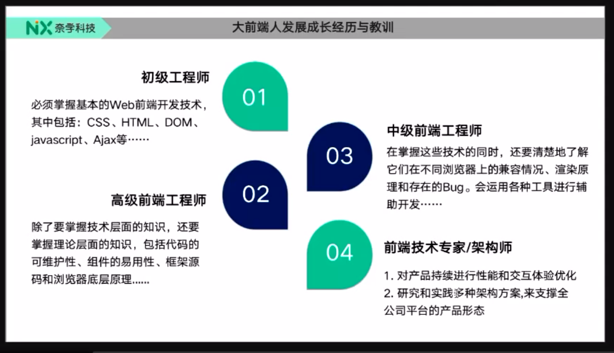
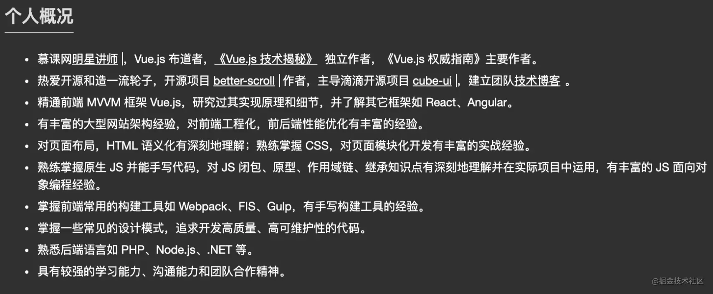
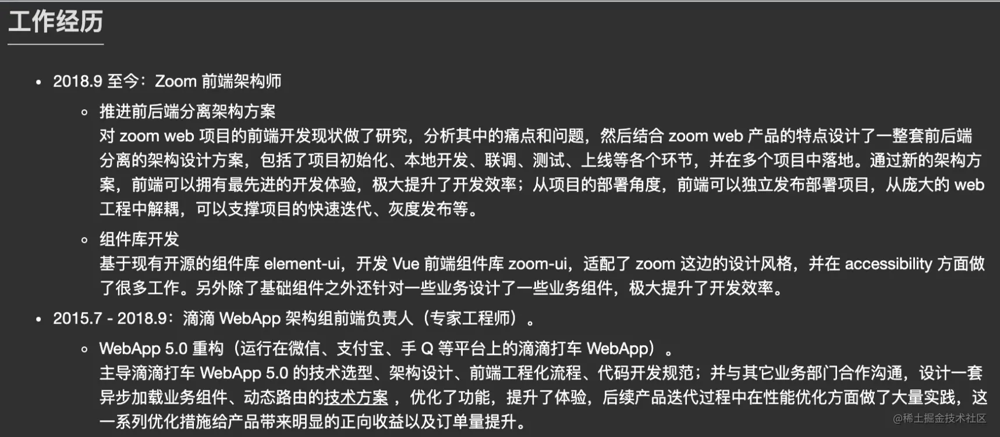
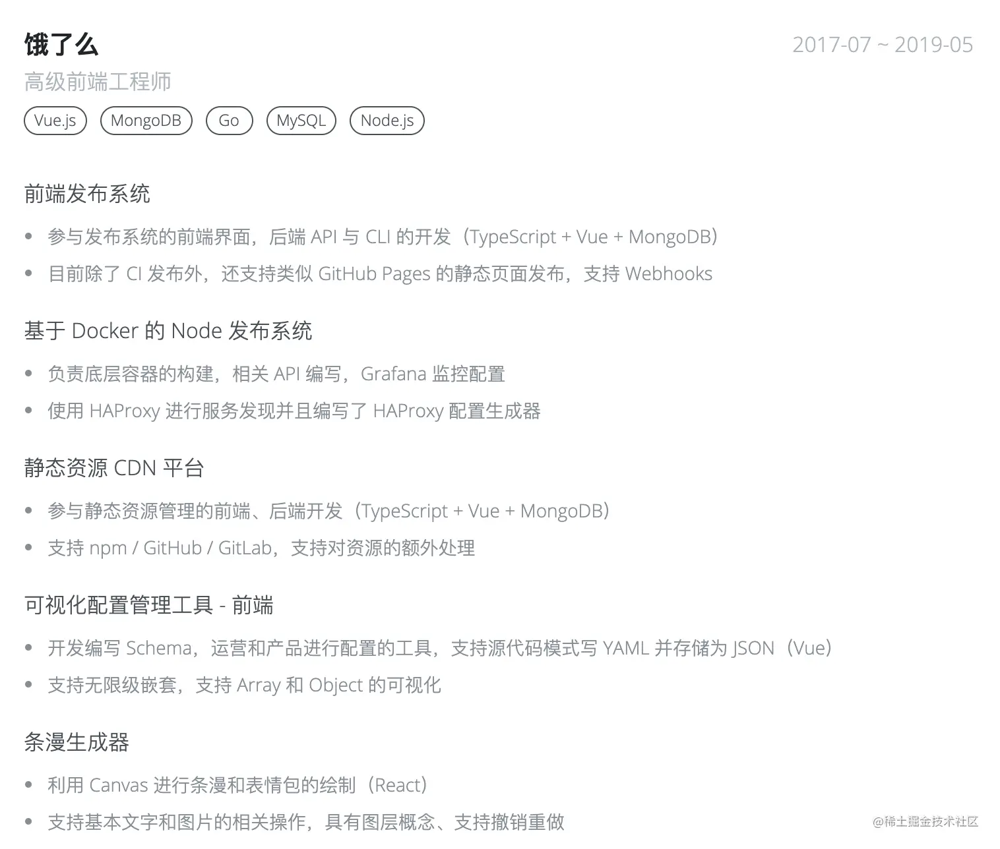

# <center>如何写[前端简历]</center>

## 前言

本文来自字节跳动-基础工程-APM 团队合作编写。

这篇文章的目的，就是帮助你了解：怎么样的一份简历可以更容易通过面试官的筛选。

- 适用人群：社招、校招、实习
- 适用目标：进入大厂

本篇文章会从一下几个角度切入，根据简历需要的日常积累学习：

1. 不同阶段的工程师分别应该有一份怎样的简历
2. 如何规划简历结构
3. 如何避免简历中的“坑”
4. 如何优化简历的细节
5. 优秀简历的片段摘选

## 目录

一、不同阶段的简历  
二、如何规划简历结构  
三、如何避免简历中的“坑”  
四、如何优化简历的细节  
五、优秀简历片段摘录  
六、岗位方向

## 一、不同阶段的简历

### (一) 校招 -1 年【初级前端工程师】

这个阶段还属于成长期，更需要看重的是你的基础和热情。对于 JS 基础，计算机基础，网络通信，算法等部分的要求会相对高一些。毕竟这个阶段比较难考察你的业务项目中的沉淀，所以只能从基础部分入手考察。

1. 在学校学习，或是利用网络上的各种资料巩固自己的基础，是这个阶段的关键。
2. 在简历里用各种方式展示出你对前端的热情，让面试官看到你的潜力。
3. 多去了解社区前沿技术，关注国内外的各种技术趋势。
4. 尝试自己写一些小项目，或者是参与社区开源的项目。
5. 开始记录自己的技术博客，尝试费曼学习法，用输出倒逼你的输入。

### (二) 1 年 - 4 年【中高级前端工程师】

这个阶段一般来说是向着独当一面的工程师发展。也是非常关键的一个时期，避免一年的经验用三年。

1. 社区里关于进阶的资料和路线有很多，平时多关注一下，补齐自己的基础知识。
2. 平时常用的框架进阶一步去使用，比如它的一些高级用法是否有所掌握，有没有试着去了解它的原理实现。
3. 日常的业务开发中不局限于完成功能，是否有去思考项目结构如何设计，如何封装基础工具，基础组件如何设计、开发、共享。
4. 在日常的业务开发中有没有去思考团队提效的方式，比如：
   - 接入 eslint、prettier 等代码检验、风格统一的插件。
   - 工程化的角度思考本地开发的提效，如何去进行 webpack 构建的优化，最近社区 esbuild 很火，尝试去接入一下。vite 和 snowpack 的思路很赞，能不能在新项目中运用起来等等。
   - 平常如果经常有多项目开发的需求，整理出差异和统一的部分，建立团队内部的脚手架避免重复劳动。
   - 尝试搭建 CI / CD 平台，尝试搭建 npm 私服维护自己公司内部的通用包。
5. 锻炼你的软技能，沟通协作也是很重要的一项能力。通过思考业务真实需求砍掉多余的需求，协调各个角色一起推进目标，也是高级工程师很重要的技能。

   以字节 APM 团队（Application Performance Monitor）为例，我们的业务就是性能监控相关。那么你在日常的业务中有没有关注过网站的性能指标，是否尝试过调研、接入开源的性能监控平台，是否了解性能监控 sdk 的一些原理，这些都会让我们觉得你和团队的契合度很高，当然这不是必要的，在其他方面亮眼的经历会让我们觉得你的学习能力足够 cover 这些。

### (三) 4 年以上【资深前端工程师】

走到这个阶段，可能就往【技术专家】或者【管理的方向】前进了。我们希望你

1. 可以把握某（多）个具体产品或者技术方向的研发工作，独立负责一个复杂度高的项目。
2. 突破其中的关键技术。
3. 需要具备相当的【产品视野】和【技术深度】，需要站在更宏观的角度来看问题。
4. 也需要具备一定的跨团队协作能力。
5. 能够制定所负责方向的【产品】和【技术规划】，并推动落地，
6. 同时在【研发效率】、【研发质量】、【资源使用率】、【产品渗透率】等方面有一定的提高。
7. 如何负责技术调研，是否关注行业前沿趋势，根据不同场景选择最优的技术方案，能不能有拍板决定的能力和魄力。
8. 技术经验是否丰富，有没有相当的技术储备，参与过的项目类型多吗，遇到的困难都是如何解决，是否有沉淀出一套自己的方法？拒绝一年的经验重复使用。
9. 产品上是否能协助甚至主导业务目标的制定，并根据业务目标划分任务，指定排期，合理的推动项目达到预期效果。
10. 是否带过团队，或者是协作过跨团队项目，带团队有什么心得，能协调处理团队成员情绪问题吗，成员技能分布不平衡等问题如何解决。
11. 如何打造一个有技术氛围的团队，不局限于自己提升技术，而是帮助团队共同成长。



## 二、如何规划简历结构

通常来说，简历结构最好遵循一定规律。一个容易突出亮点，阅读友好的简历结构可以是这样的：

1. 个人信息
2. 优势总结
3. 工作经历
4. 项目经历

### （一）个人信息

简洁明了即可，包括你的：

1. 姓名
2. 电话
3. 邮箱：最好不要是 QQ 邮箱。
4. 学校：可选，如果你的学校还不错，可以直接列出，否则放在简历最后即可，记得写清楚入学和离校时间哦。
5. 目前任职公司：可选，如果你目前的公司还不错，可以放这里，否则放在工作经历即可，简历中的工作经历一定要保证完整哦。
6. 对未来团队或者业务方向的期望：可选，如果对自己未来的规划比较明确，篇幅较长的话，甚至可以单开一个章节好好聊聊，这说明你是一个对未来规划很清晰的人。
7. 照片：可选，这个需要你自己判断是否对你的简历有加分。

### （二）优势总结

很多人漏掉了优势总结这一步，个人信息写完就开始急急忙忙的介绍自己的项目。但大厂的 HR 一天可能要看上百份简历，要一个个的从候选人的项目描述中找到你的技术栈和亮点，是不太现实的一件事情。

在个人信息下面附上一段优势介绍，是很容易加分的。

举个简单的社招工程师的例子，并不是说以下这些你都要有，根据个人情况参考即可，最好是每一项都可以列出简单的相关成就：

1. 熟悉以下类型项目的开发： PC Web、H5、小程序、Electron 桌面客户端应用、React Native 开发原生应用。
   - 陈述自己用过的技术类型，第一时间表达你可以做什么事情。
   - 让 HR 第一眼看到技术匹配度，最好和投递的职位要求结合起来。
2. 熟悉 React / Vue / Angular 技术栈，成就如：搭建了 React 后台系统，设计了权限管理体系。
   - 社招一般对框架掌握有一定要求，和部门的技术栈匹配也是加分项。
   - 如果能熟悉原理细节则更好，可以补充上。
3. 熟悉工程化建设，推动团队基础工程建设，成就如：推动 CI / CD 的建设，优化了构建流程。
   - 跳出浏览器的边界，探索更广阔的技术范围。
   - 说明你在团队提效的方向上探索，是个 team player。
4. 有良好的编码习惯，对技术有追求和热情，成就如：推动了 Code Review 体系，编写内部风格指南。
   - 任何团队都希望新进来的同学不要写一些让人匪夷所思的代码。
   - 可以列举你平时学习的渠道，知乎 / 掘金 / Medium / 各种博主等等，说不定可以和志同道合的面试官多聊聊不同平台的学习心得。
   - 可以给出你的博客地址，这是一个很容易加分的项，30 分钟的面试里你能表达给面试官的东西太有限了，但是一个有内容的博客可以在面试前就为你加分很多。
5. 社区成就，你的 Github 开源获得了多少 Star，你坚持记录了多少学习博客，你的个人网站获得了什么样的成就等等
   - 开源社区的贡献，知名项目的 Contributor 各家公司都抢着要，当然不能只是改了个错别字提个 Issue 啥的。
   - Github 如果空空如也的话，就不要列出来了，可能反而成为扣分项。
   - 如果你的博客获得不错的点赞 / 阅读，也可以列举，这说明你有把技术原理讲明白的能力，且文字表达能力不错。
6. 如果针对你投递的部门的技术栈，能够列出你在相关方面的经验和沉淀，这甚至可以成为能够直接进入面试的一个加分项。

### （三）工作经历

对于社招的同学来说，工作经历是简历中相当重要的一部分，它是你过去几年经历的总结和背书。

这里比较推荐按时间轴的方式，距离现在的时间从近到远的列出你工作过的公司，举个简单的例子：

```
腾讯
2017 - 至今
1. 带领团队完成了某某项目从零到一的建设，攻克了怎样的难题，提升了内部团队多少的效率。
2. 优化了核心项目首屏性能， 接入性能监控工具，提升了 fp, fcp 指标，整体性能提升 30%。
3. 优化了核心项目的打包构建体积，利用增量构建配合缓存总体节省70% 的 CDN 资源成本。
4. 搭建项目脚手架，集成框架全家桶，单元测试、集成测试解决方案，内部平台 CI / CD 的对接。
```

工作经历需要写的是你做成了什么，注意不是流水账一样去列举你做了什么，最好的是你给公司带来了什么样的贡献和提效。很多人在这里的宝贵位置写：“完成了一些增删改查的工作”，我一脸问号。

一般来说大厂对于社招工程师的要求肯定是要有相对亮眼的成绩，如果你的简历和大多数简历一样千篇一律，那么就比较容易被忽略。

这里挺关键的，尽量找出工作中你独立或带头做成的比较出色的事，最好辅以数据佐证。

### （四）如何避免简历中的“坑”

1. 可以适度美化，不要造假，诚信第一。
2. 避免千篇一律，不要写流水账，写你 owner 了哪些事情，做成了哪些事情。
3. 不要用奇怪的简历结构，不要漏写学校，教育经历（遇到过几次）。公司都会有简历自动识别录入系统，缺少信息会需要来回反复核对，比较麻烦。
4. 关键的信息往前放，会让你减分的信息往后点放，心里学中的「首因效应」表明了第一印象的重要性。
5. 多写雇主希望了解你的信息，无关紧要的信息尽量减少，比如你是社招的同学，在学校社团的经历什么的就可以淡化了。

### （五）如何优化简历的细节

1. 注意简历文件的命名，准确的包含你的姓名-目标岗位-工作地点。
   - （错误）张三简历.pdf、张三前端.pdf、张三实习.pdf。
   - （推荐）张三-前端-社招-上海.pdf、张三-前端-实习-北京.pdf。
2. 用 PDF 而不是 Word，这是很多简历相关的文章中都会提到的一点，Word 的版本、兼容问题可能会导致在你电脑上看起来很漂亮的简历，在面试官电脑上打开就变得一塌糊涂，减少印象分。
3. 注意各种技术名词的正确拼写 / 大小写。
   - （错误）熟悉 vue，vuerouter，vuex，vue-cli
   - （正确）熟悉 Vue、vue-router，Vuex，Vue-CLI
4. 注意简历的排版细节，可以参考写给大家看的[中文排版指南](https://zhuanlan.zhihu.com/p/20506092)。
   - （错误）我熟悉 react，擅长 web 网页开发。
   - （正确）我熟悉 React，擅长 Web 网页开发。（中英文之间的空格）

### （六）优秀简历片段摘录

为了让大家能更有体感的知道一份优秀的简历是什么样的，我摘选了社区里大佬们公开的简历中的一些片段：

#### [黄轶老师的简历](https://ustbhuangyi.github.io/resume/)

比如[黄轶老师的简历](https://ustbhuangyi.github.io/resume/)，这是一份典型的自带社区光环的大佬的简历，讲师的身份以及撰写的书籍在开头就吸引了招聘者的注意，开源项目也获得了非常高的社区赞誉，下面列举的技能的格式也是范例：



而在工作经历中，他也清晰简洁的描述出了自己在公司推动了什么事情，解决了什么难点，而不是千篇一律的流水账。



#### [芋头大佬简历](https://www.zhihu.com/question/23150301)

比如芋头大佬在知乎回答中提到的一句话描述自己的优势：

主攻前端和 NodeJS 开发，6 年+前端开发经验，呆过大公司和小团队，从 0 组建 20 人前端 NodeJS 混合开发团队，带领团队利用最新技术解决业务快速发展过程中的各种业务场景问题。熟悉客户端开发，有多个上架 APP，有 Java 开发经验。

很清晰明了的表明了自己的优势，这一段话就涵盖了擅长的方向、带团队的经验、跨端的经验、解决问题的能力等等，非常吸引招聘者的目光。

#### [敖天羽同学的简历](https://hacknical.com/csvwolf/resume?locale=zh)

再比如敖天羽同学的简历：


从这些优秀的简历中你可以发现一些共同点，向他们学习。

## 总结：

捋清楚前端开发的职责，从平时开发中、技术提升、日常积累中提高能力，才有东西可以写。
从这些优秀的简历中你可以发现一些共同点，向他们学习。
